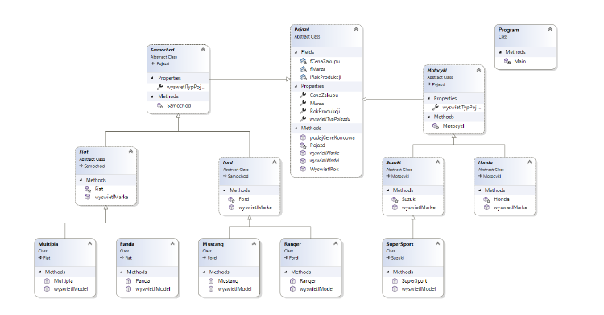

# Kolokwium programowanie obiektowe C#
Poniżej znajdują się treści zadań, które sprawdzają efekty EK_04, EK_05, EK_06. Zadania należy rozwiązywać sekwencyjnie, tzn. np. aby otrzymać ocenę 3 należy rozwiązać zadanie 1, na ocenę 4 należy poprawnie rozwiązać zadanie 1 i 2, natomiast aby otrzymać ocenę 5 należy rozwiązać wszystkie zadania. Rozwiązania zadań w postaci plików *.cs należy umieścić w jednym folderze o nazwie `nr_albumu_PO` (w12345_PO) i skompresować do formatu *.zip o tej samej nazwie, a następnie przesłać do zadania utworzonego na MSTeams. Kody programu muszą zawierać najważniejsze komentarze. Należy przetestować zaimplementowane rozwiązanie.

 

## Zadanie 1 – ocena `3.0`
W oparciu o poniższy diagram klas należy zaimplementować odpowiednie klasy i metody. Klasa uruchomieniowa powinna przetestować działanie zaprojektowanej hierarchii klas.

## Zadanie 2 – ocena `4.0`
Wykorzystując zaproponowane rozwiązanie z poprzedniego zadania należy rozbudować program o obsługę wyjątków oraz walidację danych. W programie główmy należy utworzyć listę obiektów i przetestować działanie zaproponowanego rozwiązania.

## Zadanie 3 – ocena `5.0`
Wykorzystując zaproponowane rozwiązanie z poprzedniego zadania należy rozbudować program o pobieranie danych z wykorzystaniem interfejsów, input output danych w tym:

• dane powinny być wczytywane z dowolnej bazy w bazie powinny być przechowywane informacje o danych wejściowych i otrzymanych rezultatach.
