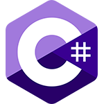

 

## Spis treści:

### Programowanie obiektowe 1:
[Lab01](object-oriented%20programming%201/LAB1) - Lab1
- [Rozwiązanie zadania](https://github.com/dawidolko/Programming-Cs/tree/main/object-oriented%20programming%201/LAB1)
  
[Lab02](object-oriented%20programming%201/LAB2) - Lab2
- [Rozwiązanie zadania](https://github.com/dawidolko/Programming-Cs/tree/main/object-oriented%20programming%201/LAB2)
  
[Lab03](object-oriented%20programming%201/LAB3) - Lab3
- [Rozwiązanie zadania](https://github.com/dawidolko/Programming-Cs/tree/main/object-oriented%20programming%201/LAB3)
  
[Lab04](object-oriented%20programming%201/LAB4) - Lab4
- [Rozwiązanie zadania](https://github.com/dawidolko/Programming-Cs/tree/main/object-oriented%20programming%201/LAB4)
  
[Lab05](object-oriented%20programming%201/LAB5) - Lab5
- [Rozwiązanie zadania](https://github.com/dawidolko/Programming-Cs/tree/main/object-oriented%20programming%201/LAB5)
  
[Lab06](object-oriented%20programming%201/LAB6) - Lab6
- [Rozwiązanie zadania](https://github.com/dawidolko/Programming-Cs/tree/main/object-oriented%20programming%201/LAB6)
  
[Lab07](object-oriented%20programming%201/LAB7) - Lab7
- [Rozwiązanie zadania](https://github.com/dawidolko/Programming-Cs/tree/main/object-oriented%20programming%201/LAB7)

### Programowanie obiektowe 2:
[Lab01](https://github.com/dawidolko/Programming-Cs/tree/main/object-oriented%20programming%202/Lab1) - Lab1
- [Rozwiązanie zadania](https://github.com/dawidolko/Programming-Cs/tree/main/object-oriented%20programming%202/Lab1)
  
[Lab02](https://github.com/dawidolko/Programming-Cs/tree/main/object-oriented%20programming%202/Lab2) - Lab2
- [Rozwiązanie zadania](https://github.com/dawidolko/Programming-Cs/tree/main/object-oriented%20programming%202/Lab2)
  
[Lab03](https://github.com/dawidolko/Programming-Cs/tree/main/object-oriented%20programming%202/Lab3) - Lab3
- [Rozwiązanie zadania](https://github.com/dawidolko/Programming-Cs/tree/main/object-oriented%20programming%202/Lab3)
  

### Projekty:
**[Co to projekty?](projects/README.md) - Definicja i zagadnienia**
 - [Repozytorium](https://github.com/dawidolko/Programming-Cs/tree/main/projects)

### Kursy:

**[Co to kursy?](Courses/README.md) - Definicja i zagadnienia**
- **[Kurs 1](https://github.com/dawidolko/Programming-Cs/tree/main/Courses/Course1)**
  - [Opis kursu](Courses/Course1/README.md)

 
  
- **[Kurs 2](https://github.com/dawidolko/Programming-Cs/tree/main/Courses/Course2)**
  - [Opis kursu](Courses/Course2/README.md)

 
  
- **[Kurs 3](https://github.com/dawidolko/Programming-Cs/tree/main/Courses/Course3)**
  - [Opis kursu](Courses/Course3/README.md)

