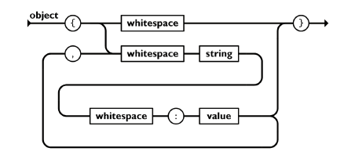

# Programowanie obiektowe – C#
## WCZYTYWANIE PLIKÓW
Do wczytywania plików możemy skorzystać z klasy StreamReader, która pozwala na otwieranie,
czytanie i zamykanie pliku tekstowego. Ścieżkę pliku przekazyjemy poprzez konstruktor
StreamReader’a, aby następnie automatycznie otworzyć plik. Metoda ReadLine odczytuje każdy
wiersz tekstu i zwiększa wskaźnik pliku do następnego wiersza podczas odczytu. Gdy metoda
ReadLine osiągnie koniec pliku, zwraca odwołanie zerowe.
```
//Otwieramy stream pliku sample.txt
using (var sr = new StreamReader("sample.txt"))
{
    var line = sr.ReadLine();
    while (line != null)
  {
    Console.WriteLine(line);
    //Wczytaj kolejną linię
    line = sr.ReadLine();
  }
}
```
Możemy również wykorzystać metodę ReadToEnd, która wczytuje cały stream do końca z obecnej
pozycji.
```
//Otwieramy stream pliku sample.txt
using (var sr = new StreamReader("sample.txt"))
{
  var line = sr.ReadToEnd();
  Console.WriteLine(line);
}
```
### Zapis do pliku
Do zapisu danych do pliku wykorzystam klasy StreamWriter, która pozwala na otwieranie,
zapisywanie i zamykanie pliku tekstowego. W podobny sposób jak klasa StreamReader, ścieżkę pliku
przekazujemy do konstruktora StreamWriter, aby automatycznie otworzyć plik. Metoda WriteLine
zapisuje pełną linię tekstu do pliku tekstowego.
```
//Otwieramy stream pliku sample.txt
using (var sw = new StreamWriter("sample.txt"))
{
  sw.WriteLine("Hello World!!");
  sw.WriteLine("From the StreamWriter class");
}
```
Aby dopisać wartości do pliku (a go nie nadpisać), w konstruktorze StreamWriter musimy ustawić
flagę append na true.
```
//Otwieramy stream pliku sample.txt
using (var sw = new StreamWriter("sample.txt", append: true))
{
  sw.WriteLine("Hello World!!");
  sw.WriteLine("From the StreamWriter class");
}
```
### JSON
JSON (JavaScript Object Notation) jest prostym formatem wymiany danych. Zapis i odczyt danych w
tym formacie jest łatwy do opanowania przez ludzi. Jednocześnie, z łatwością odczytują go i generują
komputery. Jego definicja opiera się o podzbiór języka programowania JavaScript. JSON jest formatem
tekstowym, całkowicie niezależnym od języków programowania, ale używa konwencji, które są znane
programistom korzystającym z języków z rodziny C, w tym C++, C#, Java, JavaScript, Perl, Python i
wielu innych. Właściwości te czynią JSON idealnym językiem wymiany danych. JSON powstał w
oparciu o dwie struktury:

· Zbiór par nazwa/wartość. W różnych językach jast to implementowane jako obiekt, rekord,
struktura, słownik, tabela hash, lista z kluczem, albo tabela asocjacyjna.

· Uporządkowana lista wartości. W większości języków implementuje się to za pomocą tabeli,
wektora, listy, lub sekwencji.

W przypadku formatu JSON, przybierają one następujące formy:

Obiekt jest nieuporządkowanym zbiorem par nazwa/wartość. Opis obiektu rozpoczyna {lewa klamra a
kończy }prawa klamra. Po każdej nazwie następuje :dwukropek oraz pary nazwa/wartość, oddzielone
,przecinkiem.

<br>

Wspomniane struktury danych są uniwersalne. Prawie wszystkie nowoczesne języki programowania
posługują się nim w tej lub innej formie. Ma to sens, by format danych, który jest przenośny pomiędzy
różnymi językami programowania opierał swoją budowę na wspomnianych strukturach.
```
{
  "fruit": "Apple",
  "size": "Large",
  "color": "Red"
}
```
### Serializacja pliku JSON
Aby ułatwić sobie serializację i deserializację pliku JSON wykorzystamy bibliotekę Newtonsoft.Json.
### Deserializacja:
```
JsonConvert.DeserializeObject<typetodeserialize>(jsonstring);
Serializacja:
JsonConvert.SerializeObject(object);
```
### Zadania do samodzielnego wykonania:
### 1. 
Napisz program pozwalający na zapisanie do pliku o wskazanej nazwie, nr albumu osoby, która
napisała program.
### 2. 
Napisz program pozwalający na wczytanie zawartości pliku o wskazanej nazwie.
### 3. 
Napisz program wczytujący listę peseli z pliku pesels.txt, a następnie zaimplementuj funkcję
sprawdzającą, ile jest żeńskich peseli we wczytanym zbiorze.
### 4. 
Wykorzystując bazę danych `db.json`, zawierającą informację o populacji USA, Indii i Chin od
roku 1960, napisz program:

· Pozwalający sprawdzić ile wynosi różnica populacji pomiędzy rokiem 1970 a 2000 dla Indii

· Pozwalający sprawdzić ile wynosi różnica populacji pomiędzy rokiem 1965 a 2010 dla USA

· Pozwalający sprawdzić ile wynosi różnica populacji pomiędzy rokiem 1980 a 2018 dla Chin

· Pozwalający użytkownikowi na wybranie roku i kraju, z którego populację chciałby
wyświetlić.

· Pozwalający użytkownikowi na sprawdzenie różnicy populacji dla wskazanego zakresu lat i
kraju,

· Pozwalający użytkownikowi na sprawdzenie procentowego wzrostu populacji dla każdego
kraju względem roku poprzedniego do wskazanego,
### 5. 
Napisz program implementujący interfejs IPersonRepository, poprzez klasę FilePersonRepository
pracującą na plikowej bazie danych. (Json, record per line,etc).
