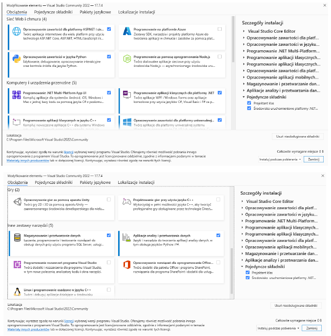
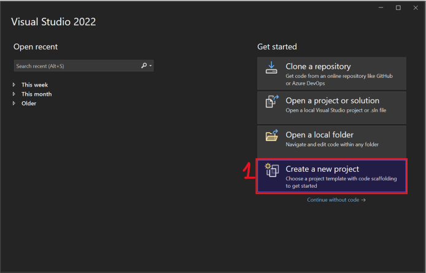
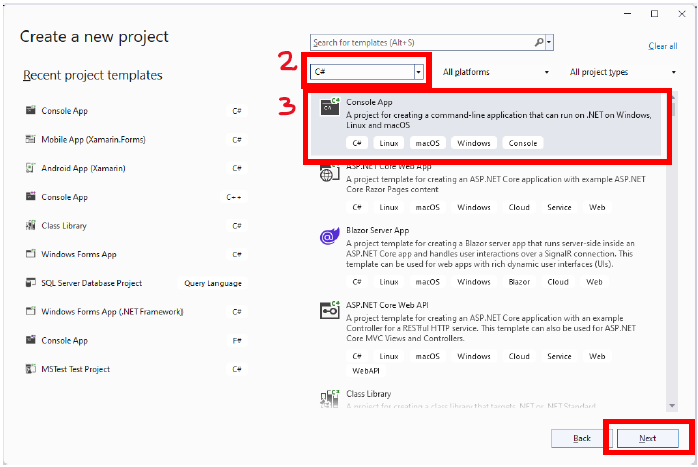
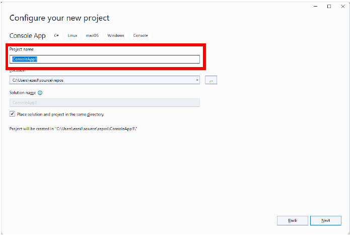
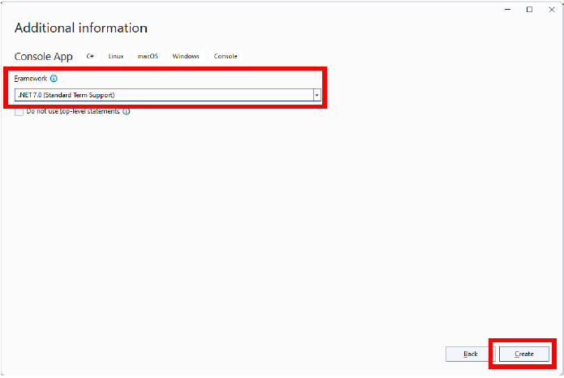
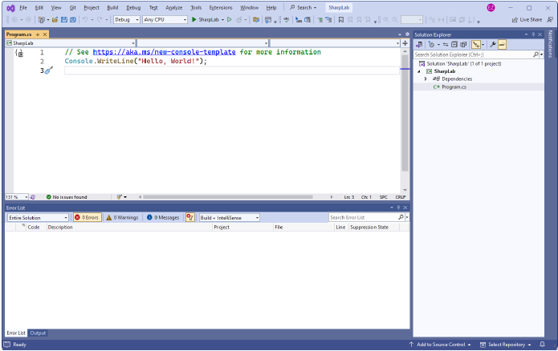

# LABORATORIUM 1 
## TREŚCI KSZTAŁCENIA: PRACA W ŚRODOWISKU VISUAL STUDIO, TWORZENIE PROSTYCH PROGRAMÓW W JĘZYKU C# (LICZBA GODZIN: 4H). 

### 1. Praca w środowisku Visual studio 
Instalacja: 

W celu realizacji zagadnień związanych z programowaniem w C# należy zainstalować poniższe składniki: 

<br>

Informacje dotyczące usługi GitHub dla VS można znaleźć pod adresem (data dostępu 19.09.2023): 
[link](https://visualstudio.microsoft.com/pl/vs/github/)
 	 
### 2.	Tworzenie nowego projektu: 
Po otwarciu VS wybieramy 1 następnie 2 i 3 i klikamy Next. 

<br>
<br>

Nadajemy name projektowi i przechodzimy dalej w celu wybrania Framework (wybieramy obecnie używany standard) i klikamy Create.

<br>
<br>

Widok utworzonego projektu:

<br>

### 3.	Tworzenie prostych programów w języku C# 
Poniżej przedstawiono przykład z podstawowymi informacjami związanymi z wyświetlaniem danych, deklaracją zmiennych, rzutowaniem danych  
```c#
//Wyświetlanie danych na consoli Output using System.Drawing; using System; 
 
Console.WriteLine("Hello, World!"); 
Console.WriteLine("i am Learning C#"); 
 
Console.WriteLine(3+3); 
Console.WriteLine(); 
 
//Console.WriteLine 
Console.Write("Hello, World!"); 
Console.Write("I will print on the same line."); 
 
// komentarz jednolinikowych  /* komentarz wielolinikowy  next line next line  skróty klawiszowe:  
Comment/Uncomment selection Ctrl+K+C Ctrl+K+U  
 */ 
 
//C# Variables 
/*type of variables: 
*	int - stores integers (whole numbers), without decimals, such as 123 or -123; 
*	double - stores floating point numbers, with decimals, such as 19.99 or 19.99; 
*	char - stores single characters, such as 'a' or 'B'. Char values are surrounded by single quotes; 
*	string - stores text, such as "Hello World". String values are surrounded by double quotes; 
*	bool - stores values with two states: true or false; 
 */ 
 
//Declaring (Creating) Variables 
//type variableName = value; 
 
int a =2, b=1, c; float f1 = 35e3F; double d1 = 3.23; char charA= 'a'; string firstName = "ala "; string lastName = "nowak"; bool boolValue = false; 
 
Console.WriteLine("\nWartosc int: " + b); 
Console.WriteLine("Wartosc double: " + d1); 
Console.WriteLine("Wartosc char: " + charA); 
Console.WriteLine(firstName + lastName); 
Console.WriteLine(boolValue); 
Console.WriteLine("a + b = "+ (a+b)); 
 
//C# Rzutowanie danych 
/*Rzutowanie typów ma miejsce,  
 * gdy wartość jednego typu danych jest przypisywana do innego typu.
 * Implicit Casting (automatically) - converting a smaller type to a larger type size 
  char -> int -> long -> float -> double 
Explicit Casting (manually) - converting a larger type to a smaller size type double -> float -> long -> int -> char 
 */  int intA = 5; 
double doubleA = intA; //rzutowanie automatyczne 
 
Console.WriteLine(intA);      // Outputs 5 
Console.WriteLine(doubleA);   // Outputs 5 
 
double myDouble = 9.78; 
int myInt = (int)myDouble;    // rzutowanie ręczne: double to int 
 
Console.WriteLine(myDouble);   // Outputs 9.78 
Console.WriteLine(myInt);      // Outputs 9 
 
//Type Conversion Methods 
/* 
Możliwe jest również jawne konwertowanie typów danych za pomocą wbudowanych metod,  
takich jak: Convert.ToBoolean, Convert.ToDouble, Convert.ToString,  
Convert.ToInt32 (int) i Convert.ToInt64 (long) 
 */  
int myInt1 = 10; double myDouble1 = 5.25; bool myBool = true; 
 
Console.WriteLine(Convert.ToString(myInt1));    // convert int to string 
Console.WriteLine(Convert.ToDouble(myInt1));    // convert int to double 
Console.WriteLine(Convert.ToInt32(myDouble1));  // convert double to int Console.WriteLine(Convert.ToString(myBool));   // convert bool to string 
 
Wczytywanie danych z klawiatury: 
//Input 
 
Console.WriteLine("Enter username: "); string userName = Console.ReadLine(); 
Console.WriteLine("Username is: " + userName); 
W poniższym przykładzie związanym z podaniem wieku pojawi się błąd związany z konwersja danych.  
Console.WriteLine("Enter your age:"); int age = Console.ReadLine(); 
Console.WriteLine("Your age is: " + age); 
Metoda Console.ReadLine() zwraca ciąg znaków. Dlatego nie można uzyskać informacji z innego typu danych, takiego jak int. Program spowoduje błąd: 
Cannot implicitly convert type 'string' to 'int' 
Console.WriteLine("Enter username: "); string userName = Console.ReadLine(); Console.WriteLine("Username is: " + userName); 
 
//rozwiązanie 
Console.WriteLine("Enter your age:"); int age = Convert.ToInt32(Console.ReadLine()); Console.WriteLine("Your age is: " + age); 
W C# wyróżnić można następujące operatory: 
Matematyczne: +, -, *, / , % (modulo), ++ (inkrementacja przyrostkowa i prefiksowa)), -- (dekrementacja przyrostkowa oraz prefiksu). 
 
int a = 1, b = 2; 
Console.WriteLine("a + b = "+ (a+b)); 
Console.WriteLine("a - b = "+ (a-b)); 
Console.WriteLine("a * b = "+ (a*b)); 
Console.WriteLine("a / b = "+ (a/b)); 
Console.WriteLine("a % b = "+ (a%b)); 
 
//Operator inkrementacji przyrostkowej int i = 3; 
Console.WriteLine(i);   // output: 3 
Console.WriteLine(i++); // output: 3 
Console.WriteLine(i);   // output: 4 
 
//Operator inkrementacji prefiksu 
double myDouble = 1.5; 
Console.WriteLine(myDouble);   // output: 1.5 
Console.WriteLine(++myDouble); // output: 2.5 
Console.WriteLine(myDouble);   // output: 2.5 
 
 
// Operator dekrementacji przyrostkowej int j = 3; 
Console.WriteLine(j);   // output: 3 
Console.WriteLine(j--); // output: 3 
Console.WriteLine(j);   // output: 2 
 
//Operator dekrementacji prefiksu 
double myDoubleA = 1.5; 
Console.WriteLine(myDoubleA);   // output: 1.5 
Console.WriteLine(--myDoubleA); // output: 0.5 
Console.WriteLine(myDoubleA);   // output: 0.5  
 
Operatory przypisania: +=, -=, *=., /=, %=, &=, |=, ^=, >>=, <<= . 
Operatory porównania: ==, !=, >, <, >=, <=. 
Operatory logiczne: && (and), || (or) ! (not). 
W C# zdefiniowana jest klasa Math, która posiada wiele metod umożliwiających wykonywanie zadań matematycznych na liczbach. 
int a = 5, b = 10; 
Console.WriteLine("Wartośc min z pary liczb: " + a + " i " + b + " wynosi : " + Math.Min(a, b)); 
Poniżej przedstawiono przykład dla zmiennych string: 
//string example 
 
string str1 = "Hello"; 
string str2 = "To jest string zawierajacy wiele znakow"; 
 
Console.WriteLine(str1); 
Console.WriteLine(str2); 
 
//string length 
Console.WriteLine("Dlugosc str2: "+ str2.Length); 
Console.WriteLine(str1.ToLower()); 
Console.WriteLine(str1.ToUpper()); 
 
string firstName = "Jan "; string lastName = "Kowalski"; 
 
Console.WriteLine(firstName + lastName); 
 
//metoda Concat() 
 
string name = string.Concat(firstName, lastName); Console.WriteLine(name); 
C# String Interpolation – interpolacja ciągów pozwala zastępować wartości zmiennych symbolami zastępczymi w ciągu znaków. 
string firstName = "Jan"; string lastName = "Nowak"; 
string name = $"Imie i nazwisko: {firstName} {lastName}"; Console.WriteLine(name); 
Instrukcje warunkowe: 
int a = 2; 
 
if (a == 1) 
{ 
    //instrukcje 
} 
else if (a > 0) 
{ 
    //instrukcje 
} else 
{ 
    //instrukcje 
}  
if (false) { } else { } 
Istnieje również operator skrótu if else, który jest znany jako operator trójargumentowy, ponieważ składa się z trzech operandów. Można go użyć do zastąpienia wielu wierszy kodu jednym wierszem. Jest on często używany do zastępowania prostych instrukcji if else: 
variable = (condition) ? expressionTrue :  expressionFalse; 
//zapis I int time = 20; if (time < 18) 
{ 
    Console.WriteLine("Good day."); 
} else 
{ 
    Console.WriteLine("Good evening."); 
} 
 
//użycie operatora trójargumentowego int time = 20; 
string result = (time < 18) ? "Good day." : "Good evening."; Console.WriteLine(result); 
 
int x = 50; int y = 10; 
string result = (x > y) ? "wartosc x wieksza" : "wartosc y wieksza";  Console.WriteLine(result); 
Instrukcja wyboru: 
// instrukcja wyboru switch (switch_on) 
{     case 1:         //code block         break;     case 2:         //code block         break;     default:         //code block         break; } 
Instrukcje iteracyjne: 
// instrukcje iteracyjne Console.WriteLine("Petla while: "); int i = 0; while (i < 5) 
{ 
    Console.Write(i + " ");     i++; 
} 
 
Console.WriteLine("\nPetla do while"); i = 0; do 
{ 
    Console.Write(i + " ");     i++; } 
while (i < 5); 
 
Console.WriteLine("\nPetla for"); for (i = 0; i < 5; i++) 
{ 
    Console.Write(i+ " "); 
} 
 
Console.WriteLine("\nPetla foreach: "); string[] cars = { "Volvo", "BMW", "Ford", "Mazda" }; foreach (string item in cars) 
{ 
    Console.Write(item+ " "); 
} 
Break i continue  
//break int i; 
for (i = 0; i < 10; i++) 
{     if (i == 4)     {         break; 
    } 
    Console.WriteLine(i); 
} 
 //continue 
for (i = 0; i < 10; i++) 
{ 
    if (i == 4)     {         continue; 
    } 
    Console.WriteLine(i); 
} 
 
//Break and Continue w instrukcji iteracyjnej i = 0; while (i < 10) 
{ 
    Console.WriteLine(i);     i++;     if (i == 4)     {         break; 
    } 
}  i = 0; while (i < 10) 
{ 
    if (i == 4)     {         i++;         continue; 
    } 
    Console.WriteLine(i);     i++; 
} 
Tablice 
//deklaracja  tablicy string[] cars1; 
// deklaracja tablicy z inicjalizacja tablicy string[] cars = { "Volvo", "BMW", "Ford", "Mazda" }; int[] myNum = { 10, 20, 30, 40 }; 
 
//dostep do elementów tablicy 
Console.WriteLine("Pierwszy element tablicy: " + cars[0]); 
 
//zmiana elementow tablicy cars[0] = "Opel"; 
Console.WriteLine("Pierwszy element tablicy: "+ cars[0]); 
 
//dlugosc tablicy 
Console.WriteLine("Dlugosc tablicy: "+ cars.Length); 
 
//inne sposoby tworzenia tablicy string[] cars = new string[4]; 
string[] cars = new string[4] { "Volvo", "BMW", "Ford", "Mazda" }; string[] cars = new string[] { "Volvo", "BMW", "Ford", "Mazda" }; string[] cars = { "Volvo", "BMW", "Ford", "Mazda" }; 
 
//uwaga jezeli deklarujsz tablice a potem ja inicjujesz pamietaj o uzyciu operatora new 
 
// deklaracja tablicy string[] cars; 
 
// dodanie wartosci z użyciem new 
cars = new string[] { "Volvo", "BMW", "Ford" }; 
 
// dodanie wartosci bez uzycia new spowoduje blad cars = { "Volvo", "BMW", "Ford"}; 
Przeglądanie tablicy: 
// przegladanie tablicy petla for 
string[] cars = { "Volvo", "BMW", "Ford", "Mazda" }; 
for (int i = 0; i < cars.Length; i++) 
{ 
    Console.WriteLine(cars[i]); 
} 
 // foreach 
string[] cars = { "Volvo", "BMW", "Ford", "Mazda" }; foreach (string i in cars) 
{ 
    Console.WriteLine(i); 
} 
Sortowanie tablicy 
// sortowanie tablicy 
string[] cars = { "Volvo", "BMW", "Ford", "Mazda" }; Array.Sort(cars); foreach (string i in cars) 
{ 
    Console.WriteLine(i); 
}  
int[] myNumbers = { 5, 1, 8, 9 }; Array.Sort(myNumbers); foreach (int i in myNumbers) 
{ 
    Console.WriteLine(i); } 
Tablice wielowymiarowe  
// tablice wielowymiarowe 
int[,] numbers = { { 1, 4, 2 }, { 3, 6, 8 } }; 
 
Console.WriteLine(numbers[0, 2]);  // Outputs 2 numbers[0, 0] = 5;  // Change value to 5 
Console.WriteLine(numbers[0, 0]); // Outputs 5 instead of 1 
 
foreach (int i in numbers) 
{ 
    Console.Write(i +" "); 
} 
 
 
Console.WriteLine(); 
for (int i = 0; i < numbers.GetLength(0); i++) { 
    for (int j = 0; j < numbers.GetLength(1); j++) 
    { 
        Console.Write(numbers[i, j] + " "); 
    } 
    Console.WriteLine(); 
} 
Metody 
//wywołanie metody w głowym programie Main 
 View(); int a=1,b=2; 
Console.WriteLine(a + " + " + b + " = " + sum(a, b)); 
Console.WriteLine("suma liczb 3 + 4 = " + sum(3,4)); 
Console.WriteLine("suma liczb 3 + 4 = " + sum(3,4)); 
 
 
//deklaracja metody wraz z ciałem metody static void View() {     Console.WriteLine("Hello"); 
}  
static int sum(int a, int b) {      return a + b; } 
 
Przeciążenie metod: 
int myNum1 = PlusMethodInt(8, 5); double myNum2 = PlusMethodDouble(4.3, 6.26); Console.WriteLine("Int: " + myNum1); 
Console.WriteLine("Double: " + myNum2); 
 
 
//przeciążenie metod 
static int PlusMethodInt(int x, int y) 
{ 
    return x + y; 
}  
static double PlusMethodDouble(double x, double y) 
{ 
    return x + y;
} 
```

## Zadania do samodzielnego rozwiązania 
Rozwiązania powinny być zdefiniowane z wykorzystaniem metod i odpowiednio wywołane w głównej funkcji main.  

### [Zadanie 1.](https://github.com/dawidolko/Programming-Cs/tree/main/object-oriented%20programming%202/Lab1/TASK1)	
Napisz program obliczający wyróżnik delta i pierwiastki trójmianu kwadratowego. 
### [Zadanie 1.](https://github.com/dawidolko/Programming-Cs/tree/main/object-oriented%20programming%202/Lab1/TASK2)	
Napisz kalkulator obliczający: sumę, różnicę, iloczyn, iloraz, potęgę, pierwiastek, oraz wartości funkcji trygonometrycznych dla zadanego kąta. Użyj biblioteki Math np. Math.Sin(2.5). Proszę pamiętać, że wartości kąta podawane do funkcji mierzone są miarą łukową. Wyniki działania algorytmów wyświetlaj na konsoli. Do obsługi menu proszę użyć konstrukcji switch-case oraz pętli while. 
### [Zadanie 1.](https://github.com/dawidolko/Programming-Cs/tree/main/object-oriented%20programming%202/Lab1/TASK3)	
Napisz program umożliwiający wprowadzanie 10-ciu liczb rzeczywistych do tablicy. Następnie utwórz następujące funkcjonalności używając pętli for: 

•	Wyświetlanie tablicy od pierwszego do ostatniego indeksu. 

•	Wyświetlanie tablicy od ostatniego do pierwszego indeksu. 

•	Wyświetlanie elementów o nieparzystych indeksach. 

•	Wyświetlanie elementów o parzystych indeksach. 

Wyniki działania algorytmów wyświetlaj na konsoli. Dla wyboru powyższych funkcjonalności programu utwórz odpowiednie menu. Do obsługi menu użyć rozbudowanej konstrukcji else-if oraz pętli do-while. 

### [Zadanie 4.](https://github.com/dawidolko/Programming-Cs/tree/main/object-oriented%20programming%202/Lab1/TASK4)	
Napisz program umożliwiający wprowadzanie 10-ciu liczb. Dla wprowadzonych liczb wykonaj odpowiednie algorytmy: 

•	oblicz sumę elementów tablicy, 

•	oblicz iloczyn elementów tablicy, 

•	wyznacz wartość średnią, 

•	wyznacz wartość minimalną, 

•	wyznacz wartość maksymalną. 

Wyniki działania algorytmów wyświetlaj na konsoli. 

### [Zadanie 5.](https://github.com/dawidolko/Programming-Cs/tree/main/object-oriented%20programming%202/Lab1/TASK5)	
Napisz program wyświetlający liczby od 20-0, z wyłączeniem liczb {2,6,9,15,19}. Do realizacji zadania wyłączenia użyj instrukcji continue; 
### [Zadanie 6.](https://github.com/dawidolko/Programming-Cs/tree/main/object-oriented%20programming%202/Lab1/TASK6)	
Napisz program, który w nieskończoność pyta użytkownika o liczby całkowite. Pętla nieskończona powinna się zakończyć gdy użytkownik wprowadzi liczbę mniejszą od zera. Do opuszczenia pętli nieskończonej użyj instrukcji break. Pętle nieskończoną realizuje się następującymi konstrukcjami: 
```c#
while(true) 
        { ciało pętli } lub for(;;) 
        { ciało pętli }
```
### [Zadanie 7.](https://github.com/dawidolko/Programming-Cs/tree/main/object-oriented%20programming%202/Lab1/TASK7)	
Napisz program umożliwiający wprowadzanie n liczb oraz sortujący te liczby metodą bąbelkową lub wstawiania. Wyniki wyświetlaj na konsoli. 

