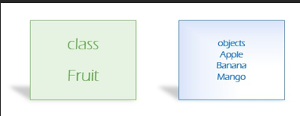

# LABORATORIUM 2 
## TREŚCI KSZTAŁCENIA: DEFINIOWANIE KLAS I OBIEKTÓW 
### Programowanie obiektowe – OOP Object-Oriented Programming. 

Programowanie proceduralne polega na pisaniu procedur lub metod, które wykonują operacje na danych, podczas gdy programowanie obiektowe polega na tworzeniu obiektów, które zawierają zarówno dane, jak i metody. 

Programowanie obiektowe ma kilka zalet w porównaniu z programowaniem proceduralnym: 

•	OOP jest szybsze i łatwiejsze do wykonania 

•	OOP zapewnia przejrzystą strukturę dla programów 

•	OOP pomaga utrzymać kod C# DRY "Don't Repeat Yourself" i sprawia, że kod jest łatwiejszy w utrzymaniu, modyfikacji i debugowaniu 

•	OOP umożliwia tworzenie pełnych aplikacji wielokrotnego użytku z mniejszą ilością kodu i krótszym czasem programowania. 

Zasada `"Don't Repeat Yourself"` (DRY) polega na ograniczeniu powtarzalności kodu. Tworząc kod programu należy wyodrębnić kody, które są wspólne dla aplikacji i umieścić je w jednym miejscu i ponownie wykorzystać zamiast powtarzać. 

Czym jest klasa i obiekt 

<br>
  
### Definicja klasy: 
```c#
modyfikator_dostepu class nazwa_klasy 
{ 
    // pola klasy 
    modyfikator_dostepu typ_danych zmienna1;     modyfikator_dostepu typ_danych zmienna2; 
    ... 
    modyfikator_dostepu typ_danych zmiennaN; 
    // metody klasy 
    modyfikator_dostepu zwracany_typ metoda1(lista_parametrow) 
    { 
        wnetrze_metody 
    } 
    modyfikator_dostepu zwracany_typ metoda2(lista_parametrow) 
    { 
        wnetrze_metody 
    }     ...     modyfikator_dostepu zwracany_typ metodaN(lista_parametrow) 
    { 
        wnetrze_metody 
    } 
} 
namespace SharpLab 
{ 
    public class Car 
    { 
        //pola klasy 
        public string color = "red";         public int rok = 2023; 
    } 
}
```
Tworzenie obiektu 
```c#
using SharpLab; 
 
Car car = new Car(); // tworzenie obiektu klasy 
Console.WriteLine("Samochod kolor: " + car.color + " rocznik: " + car.rok);
```
Metody: 
```c#
namespace SharpLab 
{ 
    public class Car 
    { 
        //pola klasy 
        public string color = "red";         public int rok = 2023; 
 
        //metody 
        public void view() { 
            Console.WriteLine("Samochod kolor: " + color + " rocznik: " + rok); 
        } 
    } 
}
```
```c#
using SharpLab; 
 
Car car = new Car(); // tworzenie obiektu klasy car.view(); 
 
//zmiana parametrów car.rok = 2021; car.color = "niebieski"; //wywołanie metody car.view();
```
Konstruktor  
```c#
namespace SharpLab 
{ 
    public class Car 
    { 
        //pola klasy         public string color;         public int rok; 
 
        //metody 
 
        //konstruktory 
        // konstruktor  domyślny bezparametrowy         public Car() {             color = "red";             rok= 100; 
        }  
        //konstruktor z parametrami 
        public Car(string color) {             this.color = color; 
        } 
        public Car(string color, int rok) {              this.color = color;             this.rok = rok; 
        }  
        public void view() { 
            Console.WriteLine("Samochod kolor: " + color + " rocznik: " + rok); 
        } 
    } 
}
```
```c#
using SharpLab; 
Car car = new Car(); // tworzenie obiektu klasy car.view(); 
 
Car car1 = new Car("niebieski"); car1.view(); 
Car car2 = new Car("czarny", 2020); car2.view(); 
 
 
//tworzenie tablicy obiektów i ich wyświetlanie 
// I sposoób 
Car[] arrayCar = new Car[5]; 
 
arrayCar[0] = new Car("Czerwony", 2023); arrayCar[1] = new Car("Niebieski", 2021); arrayCar[2] = new Car("Zielony", 1999); arrayCar[3] = new Car("Czarny", 2015); arrayCar[4] = new Car("Niebieski", 2019); 
 
foreach (Car item in arrayCar) 
{ 
    item.view(); 
} 
 
// II sposób 
Car[] arrayCar2 = new Car[] {     new Car("Czerwony", 2023),     new Car("Niebieski", 2021),     new Car("Zielony", 1999) 
}; 
 
//III sposob 
Car[] cars = new Car[3]; 
 
string[] color = { "Niebieski", "Czerwony", "Czarny" }; int[] rok = {2023, 2022,2021 }; 
 
for (int i = 0; i < cars.Length; i++) 
{ 
    cars[i] = new Car(color[i], rok[i]); }
```

### Modyfikatory dostępu: 

•	public – kod jest dostępny dla wszystkich klas; 

•	private - Kod jest dostępny tylko w obrębie tej samej klasy; 

•	protected  - Kod jest dostępny w tej samej klasie lub w klasie, która dziedziczy z tej klasy. 

•	internal - Kod jest dostępny tylko w obrębie własnego zespołu, ale nie z innego zespołu. 

## Zadania do samodzielnego rozwiązania 
### [Zadanie 1.](https://github.com/dawidolko/Programming-Cs/tree/main/object-oriented%20programming%202/Lab2/TASK1) 
Stwórz klasę Licz z: 

•	publicznym polem value przechowującym wartość liczbową.  

•	metodą Dodaj przyjmującą jeden parametr i dodającą przekazaną wartość do wartości trzymanej w polu value. 

•	analogiczną operację odejmij  

W Main utwórz kilka obiektów klasy Licz i wykonaj różne operacje. 

Do klasy Licz dodaj konstruktor z jednym parametrem - który inicjuje pole wartość na liczbę przekazaną w parametrze. 

Zmień widoczność pola na private i dodaj funkcję wypisującą stan obiektu (pole value). 

### [Zadanie 2.](https://github.com/dawidolko/Programming-Cs/tree/main/object-oriented%20programming%202/Lab2/TASK2) 
Stwórz klasę Sumator z: 

•	publicznym polem Liczby będącym tablicą liczb  

•	metodą Suma zwracającą sumę liczb z pola Liczby 

•	metodę SumaPodziel2 zwracającą sumę liczb z tablicy, które są podzielne przez 2  

Zmień widoczność pola Liczby na private oraz dodaj konstruktor.  

Dodaj metodę: int IleElementów () zwracającej liczbę elementów na w tablicy  

Dodaj metodę wypisującą wszystkie elementy tablicy  

Dodaj metodę przyjmującą dwa parametry: lowIndex oraz highIndex, która wypisze elementy o indeksach >= lowIndex oraz <= highIndex. Metoda powinna zadziałać poprawnie, gdy lowIndex lub highIndex wykraczają poza zakres tablicy (pominąć te elementy). 

### [Zadanie 3.](https://github.com/dawidolko/Programming-Cs/tree/main/object-oriented%20programming%202/Lab2/TASK3) 
Zdefiniuj klasę opisującą datę. Zastanów się nad wyborem wewnętrznej reprezentacji dat. Zdefiniuj metody pozwalające na odczytywanie bieżącej daty i przestawianie jej o jeden tydzień w przód i w tył. 

Zadbaj o dobranie odpowiednich modyfikatorów dostępu do składowych. 

### [Zadanie 4.](https://github.com/dawidolko/Programming-Cs/tree/main/object-oriented%20programming%202/Lab2/TASK4) 
Zdefiniuj klasę Liczba, która przechowuje w tablicy cyfry liczby dziesiętnej. Zdefiniuj operacje wypisywania liczby, nadawania jej wartości (w postaci parametru konstruktora będącego napisem) oraz mnożenia przez liczbę typu int. W przypadku gdy w czasie mnożenia okaże się, że tablica jest za mała, procedura mnożąca powinna kopiować jej zawartość do większej. Zdefiniuj wreszcie metodę silnia, która policzy silnię zadanej jako parametr liczby typu int.  
