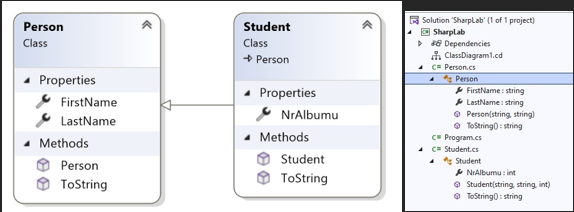

# LABORATORIUM 3 
## TREŚCI KSZTAŁCENIA: DZIEDZICZENIE I POLIMORFIZM, ENKAPSULACJA 

Enkapsulacja polega na upewnieniu się, że "wrażliwe" dane są ukryte przed użytkownikami, w celu osiągniecia należy 

•	zadeklarować pola/zmienne jako prywatne 

•	zapewnić publiczne metody get i set, poprzez właściwości, aby uzyskać dostęp i aktualizować wartość prywatnego pola 

### Przykład 
```c#
class Person 
{ 
    private string name; // field 
 
    public string Name   // property 
    { 
        get { return name; }   // get method         set { name = value; }  // set method 
    } 
}
```
Właściwość Name powiązana jest z polem name. Dobrą praktyką jest używanie tej samej nazwy zarówno dla właściwości, jak i pola prywatnego, ale z wielką pierwszą literą. Metoda get zwraca wartość zmiennej name. Metoda set przypisuje wartość do zmiennej name. Słowo kluczowe value reprezentuje wartość, którą przypisujemy do właściwości. 

Posiadając zdefiniowane właściwości get i set możemy użyć właściwości Name, aby uzyskać dostęp i zaktualizować prywatne pole klasy Person: 
```c#
// ========= Main =========================== 
 
Person myObj = new Person(); myObj.Name = "Jan"; 
Console.WriteLine(myObj.Name); 
 
// =========================================== 
  
class Person 
{ 
    private string name; // field     public string Name   // property 
    { 
        get { return name; }         set { name = value; } 
    } 
}
```
C# zapewnia również sposób korzystania z właściwości automatycznych, w których nie trzeba definiować pola dla właściwości, a wystarczy napisać get; i set; wewnątrz właściwości. Poniższy przykład da taki sam rezultat jak przykład powyżej. Jedyną różnicą jest mniejsza ilość kodu: 
```c#
// ========= Main =========================== 
 
Person myObj = new Person(); myObj.Name = "Jan"; 
Console.WriteLine(myObj.Name); 
 
// =========================================== 
  
class Person 
{ 
    public string Name  // property 
    { get; set; } 
}
```
### Plusy stosowania enkapsulacji: 

•	Lepsza kontrola nad elementami klasy (zmniejszenie możliwości zepsucia kodu przez siebie (lub innych)). 

•	Pola mogą być tylko do odczytu (jeśli używasz tylko metody get) lub tylko do zapisu (jeśli używasz tylko metody set). 

•	Elastyczność: programista może zmienić jedną część kodu bez wpływu na inne części. 

•	Zwiększone bezpieczeństwo danych 

### Dziedziczenie (klasa pochodna i bazowa) 

W języku C# możliwe jest dziedziczenie pól i metod z jednej klasy do drugiej. Koncepcję dziedziczenia dzielimy na dwie kategorie: 

•	Klasa pochodna (dziecko) - klasa, która dziedziczy z innej klasy 

•	Klasa bazowa (rodzic) - klasa, z której się dziedziczy. 

<br>

  Klasa bazowa 	Klasa pochodna 
  ```c#
  using SharpLab; 
 
// ========= Main =========================== 
 
//utworzenie obiektu Person 
Person person = new Person("Jan", "Nowak"); 
Console.WriteLine("Osoba: "+ person.ToString()); 
 
//utworzenie obiektu Student 
Student student = new Student("Jan", "Nowak", 12345); 
Console.WriteLine("Student: "+ student.ToString()); 
 
// ============================
```
```c#
namespace SharpLab 
{ 
    public class Person 
    { 
        public string FirstName { get; set; }         public string LastName { get; set; } 
 
        public Person(string FirstName, string LastName) 
        { 
            this.FirstName = FirstName;             this.LastName = LastName; 
        }  
        public override string? ToString() 
        { 
            return "Student: " + FirstName + " " + LastName; 
        } 
    }
} 
 ```
 ```c#
namespace SharpLab 
{ 
    public class Student : Person 
    { 
        public int NrAlbumu { get; set; } 
        //Słowo kluczowe base przy konstruktorze pozwala  wywowołać konsturktor klasy bazowej 
        //W tym momencie przekazaliśmy nasze parametry do konstruktora klasy bazowej         public Student(string FirstName, string LastName, int NrAlbumu) : base(FirstName, LastName) 
        { 
            this.NrAlbumu = NrAlbumu; 
        }  
        public override string? ToString() 
        { 
            return base.ToString() + " nr albumu: " + NrAlbumu; 
        } 
    } 
}
```
 	 
### Zadania do samodzielnego rozwiązania 
## [Zadanie 1 a.](https://github.com/dawidolko/Programming-Cs/tree/main/object-oriented%20programming%202/Lab3/TASK1) 
Stwórz klasy: 

•	Person z polami: `FirstName`, `LastName`, `wiek`, konstruktorem inicjującym wszystkie pola oraz metodą `View`. 

•	Book z polami: `title`, `author` (typu Person), data wydania oraz metodą `View`. 

Utwórz różne obiekty stworzonych klas. Wykonaj metody `View`. 

## [Zadanie 1 b.](https://github.com/dawidolko/Programming-Cs/tree/main/object-oriented%20programming%202/Lab3/TASK1) 
Stwórz klasę `Reader`, dziedziczącą z klasy Person. Dodatkowo klasa `Reader` powinna posiadać pole – listę / tablicę obiektów typu `Book` - listę książek przeczytanych przez danego czytelnika oraz metodę `ViewBook` - wypisujące tytuły książek, które czytelnik przeczytał. 

Stwórz 3-5 książek, 2-4 czytelników, przypisz książki do tablic / list przeczytanych książek czytelników, wykonaj metody `ViewBook`. 
## [Zadanie 1 c.](https://github.com/dawidolko/Programming-Cs/tree/main/object-oriented%20programming%202/Lab3/TASK1)
Dodaj do czytelnika metodę View, która oprócz wypisania danych czytelnika (tych samych które wypisuje `Osoba.View ()`) wypisze także listę książek przez danego czytelnikaprzeczytanych (skorzystaj z już istniejącej metody ViewBook) 

## [Zadanie 1 d.](https://github.com/dawidolko/Programming-Cs/tree/main/object-oriented%20programming%202/Lab3/TASK1)
Metody `View()` w klasach Person i Reader poprzedź odpowiednimi słowami kluczowymi, aby wykonanie kodu: 
```c#
Person o = new Reader (...); 
o.VIew();
```
spowodowało wyoknanie metody `View ()` z klasy `Reader` 
## [Zadanie 1 e.](https://github.com/dawidolko/Programming-Cs/tree/main/object-oriented%20programming%202/Lab3/TASK1)
Zmień widoczność pól w klasie `Osoba` na pola prywatne. Jeżeli trzeba popraw metodę `Reader.View ()`, aby jej rezultat nie zmienił się. Np. wykorzystaj właściwości. 
## [Zadanie 1 f.](https://github.com/dawidolko/Programming-Cs/tree/main/object-oriented%20programming%202/Lab3/TASK1)
Utwórz klasę Reviewer dziedziczącą z klasy `Reader`. `Wypisz ()` recenzenta powinno wypisać listę książek, które przeczytał, a obok każdej pozycji losową ocenę (różną dla każdego wykonania metody `Wypisz ()`). Czy do stworzenia takiej funkcjonalności konieczne jest aby lista książek w klasie Reader była protected? Czy też może posiadać widoczność private? Utwórz 2 recenzentów, przypisz im książki i wykonaj stworzoną metodę. Zadanie 1 g 
W Main stwórz listę obiektów klasy `Person (List<Person>)` dodaj do niej zarówno `Reader` jak i `Reviewer`. W pętli wykonaj metodę `View` na wszystkich obiektach z listy. 
## [Zadanie 1 h.](https://github.com/dawidolko/Programming-Cs/tree/main/object-oriented%20programming%202/Lab3/TASK1)
Zmień widoczność pól w klasie Book na protected. W razie konieczności dodaj konstruktor i popraw istniejące klasy, aby program dalej działał poprawnie. 
## [Zadanie 1 i.](https://github.com/dawidolko/Programming-Cs/tree/main/object-oriented%20programming%202/Lab3/TASK1)
Stwórz klasy AdventureBook oraz DocumentaryBook. Do każdej z nich dodaj dodatkowe pole(pola). 
## [Zadanie 1 j.](https://github.com/dawidolko/Programming-Cs/tree/main/object-oriented%20programming%202/Lab3/TASK1) – zadnie do zrealizowania po kolejnych laboratoriach 
Metodę `View ()` klasy Book zmień na virtual. Zaimplemetuj metodę View w klasach z 1i aby wypisywały dodane pola. Do list książek czytelników dodaj obiekty nowych klas i wykonaj ViewBook. Dla książek przygodowych oraz dokumentalnych powinny pojawić się opisy rozszerzone (o pola dodane w 1i). 
## [Zadanie 2](https://github.com/dawidolko/Programming-Cs/tree/main/object-oriented%20programming%202/Lab3/TASK2)
Napisz program, w którym będą dwie klasy: Samochod i SamochodOsobowy. W klasach tych powinny znajdować się następujące pola: 

•	`Samochod`: `Marka`, `Model`, `Nadwozie`, `Kolor`, `Rok produkcji`, `Przebieg` (nie może być ujemny) 

•	`SamochodOsobowy`: Waga (powinna być z przedziału 2 t – 4,5 t), Pojemność silnika (powinna być z przedziału 0,8-3,0), Ilość osób 

Klasa `SamochodOsobowy` dziedziczy po klasie Samochod. W obydwu klasach utwórz konstruktor, który pobierze dane od użytkownika. Dodatkowo w klasie Samochod przeciąż konstruktor w taki sposób, by wartości pól były parametrami metody. W klasie Samochod utwórz także metodę, która wyświetli informacje o samochodzie. Przesłoń ją w klasie SamochodOsobowy. W metodzie Main() utwórz obiekt klasy SamochodOsobowy oraz dwa obiekty klasy Samochod (wykorzystując różne konstruktory). Wyświetl informacje o samochodach. 
