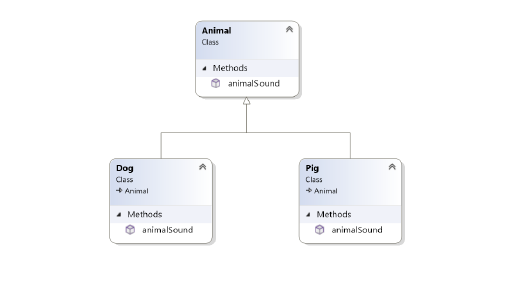

# LABORATORIUM 4 
## TREŚCI KSZTAŁCENIA: POLIMORFIZM, DEFINIOWANIE KLAS ABSTRAKCYJNYCH I INTERFEJSÓW. 
### Polimorfizm przeciążenie metod 
Pojęcie polimorfizmu w języku C# jest związane z dziedziczeniem. Polimorfizm (gre.Polýmorphos wielopostaciowy) oznacza możliwość operowania na obiektach należących do różnych klas. 

Polimorfizm oznacza "wiele form" i występuje, gdy mamy wiele klas, które są ze sobą powiązane poprzez dziedziczenie. 

Dziedziczenie pozwala nam dziedziczyć pola i metody z innej klasy. Polimorfizm wykorzystuje te metody do wykonywania różnych zadań. Pozwala nam to wykonywać jedną czynność na różne sposoby. 

Polimorfizm może być statyczy i dynamiczny. W polimorfizmie statycznym odpowiedź funkcji jest określna w trakcie kompilowania. W polimorfizmie dynamicznym odpowiedź ta jest podejmowana w czasie wykonywania programu. 

Polimorfizm statyczny  mechanim łączenia metody z obiektem w trakcie kompilacji jest nazywany wczesnym wiązaniem lub też statycznym wiązaniem. C# udostępnia dwa sposoby implementowania statycznego polimorfizmu: przeciążanie metod, przeciązanie operatorów. 

Polimorfizm dynamiczny - pozwala tworzyć klasy abstrakcyjne, które następnie są implementowane w klasach pochodnych. Klasa taka zawiera abstrakcyjne metody, których implementacja zależy od wykorzystania w poszczególnych klasach pochodnych. Poniżej lista zasad o których należy pamiętać tworząc klasy abstrakcyjne: 

•	nie można utworzyć instancji klasy abstrakcyjnej; 

•	nie można zadeklarować metody abstrakcyjnej poza klasą abstrakcyjną; 

•	kiedy klasa opatrzona jest modyfikatorem dostępu sealed nie może być dziedziczona. Dodatkowo, klasa abstrakcyjna nie może być zdefinowana jakas sealed. 

Na przykład, pomyślmy o klasie bazowej o nazwie Animal, która posiada metodę o nazwie animalSound(). Pochodnymi klasami Animals mogą być Świnie, Koty, Psy, Ptaki - i one również mają własną implementację zwierzęcego dźwięku (świnia miauczy, a kot miauczy itd.): Przykład 

<br>

```c#
namespace SharpLab 
{ 
    class Animal  // Base class (parent)  
    { 
        public virtual void animalSound() 
        { 
            Console.WriteLine("The animal makes a sound"); 
        } 
    } 
}
```

```c#
namespace SharpLab 
{ 
    class Dog : Animal  // Derived class (child)  
    { 
        public override void animalSound() 
        { 
            Console.WriteLine("The dog says: bow wow"); 
        } 
    } 
}
```

```c#
namespace SharpLab 
{ 
    class Pig : Animal  // Derived class (child)  
    { 
        public override void animalSound() 
        { 
            Console.WriteLine("The pig says: wee wee"); 
        } 
    } 
}
```

```c#
using SharpLab; 
 
// ========= Main =========================== 
 
Animal myAnimal = new Animal();  // Create a Animal object 
Animal myPig = new Pig();  // Create a Pig object 
Animal myDog = new Dog();  // Create a Dog object 
 
myAnimal.animalSound(); myPig.animalSound(); myDog.animalSound(); 
 
// ===========================================
```

Przeciążanie metod 
W tej samej definicji klasy może znajdować się wiele funkcji o tej samej nazwie. Definicja metod musi się różnić od siebie typem i/lub liczbą parametrów. Nie można przeciążyć metod, które różnią się tylko zwracanym typem. 

```c#
WyswietlanieDanych wd = new WyswietlanieDanych(); wd.Wyswietl(4); wd.Wyswietl(4.5); wd.Wyswietl("4.5"); 
 
// =========================================== 
  
class WyswietlanieDanych 
{ 
    public void Wyswietl(int i) 
    { 
        Console.WriteLine("Wyswietlana liczba: {0}", i); 
    } 
    public void Wyswietl(double d) 
    { 
        Console.WriteLine("Wyswietlana liczna: {0}", d); 
    } 
    public void Wyswietl(string s) 
    { 
        Console.WriteLine("Wyswietlany tekst: {0}", s); 
    } 
}
```

Przeciążanie operatorów 

C# pozwala na zmianę lub przeciążenie większości wbudowanych operatorów. Programista może używać operatorów z typami zdefiniowanymi również przez użytkownika. Przeciążone operatory to metody z nazwą, słowem kluczowym operator, po którym występuje symbol operatora, który chcemy zdefiniować. Przeciążony operator ma typ zwracany oraz listę parametrów. Operatory przeciążalne i nieprzeciążalne 


| Operator | Opis |
| --- | --- |
| +, -, !, ~, ++, -- | operatory jednoargumentowe mogą zostać przeciążone |
| +, -, *, /, % | operatory binarne mogą zostać przeciążone |
| ==, !=, <, >, <=, >= | operatory porównania mogą zostać przeciążone |
| &&, \|\| | operatory operacji logicznych nie mogą być przeciążone bezpośrednio |
| +=, -=, *=, /=, %= | operatory przypisania nie mogą być przeciążone |
| =, ?, :, ->, new, is, sizeof, typeof | te operatory nie mogą być przeciążone |

```c# 
// ========= Main =========================== 
 
double objetosc = 0; Pudelko p1 = new Pudelko(); 
Pudelko p2 = new Pudelko(); 
Pudelko p3 = new Pudelko(); 
 
// specyfikacja 1 p1.PobierzDlugosc(3.5); p1.PobierzSzerokosc(4.0); p1.PobierzWysokosc(5.5); 
 
// specyfikacja 2 p2.PobierzDlugosc(2.5); p2.PobierzSzerokosc(5.0); p2.PobierzWysokosc(4.5); 
 
// specyfikacja 3 p3.PobierzDlugosc(12.5); p3.PobierzSzerokosc(15.0); p3.PobierzWysokosc(14.5); 
 
// Wyswietlenie danych wewnatrz kolejnych obiektow 
Console.WriteLine("Pudelko 1: {0}", p1.ToString()); 
Console.WriteLine("Pudelko 2: {0}", p2.ToString()); 
Console.WriteLine("Pudelko 3: {0}", p3.ToString()); 
 
// objetosc 1 
objetosc = p1.ObliczObjetosc(); 
Console.WriteLine("Objetosc 1: {0}", objetosc); 
 
// objetosc 2 
objetosc = p2.ObliczObjetosc(); 
Console.WriteLine("Objetosc 2: {0}", objetosc); 
 
// Dodanie 2 obiektów p3 = p1 + p2; // objetosc 3 
objetosc = p3.ObliczObjetosc(); 
Console.WriteLine("Objetosc 3: {0}", objetosc); 
 
// porównanie obiektów if (p1 == p2) 
    Console.WriteLine("Pudełka p1 oraz p2 są identyczne"); if (p1 != p2) 
    Console.WriteLine("Pudełka p1 oraz p2 są różne"); 
Console.ReadKey(); 
```

```c#
// =========================================== 

class Pudelko 
{ 
    private double dlugosc;     private double szerokosc;     private double wysokosc; 
    public void PobierzDlugosc(double d) 
    { 
        dlugosc = d; 
    } 
    public void PobierzSzerokosc(double s) 
    { 
        szerokosc = s; 
    } 
    public void PobierzWysokosc(double w) 
    { 
        wysokosc = w; 
    } 
    public double ObliczObjetosc() 
    { 
        return (dlugosc * szerokosc * wysokosc); 
    } 
    // Przeciążenie operatora +     // Dodanie do siebie dwóch typów
```

```c#
    public static Pudelko operator +(Pudelko a, Pudelko b) 
    { 
        Pudelko pud = new Pudelko();         pud.wysokosc = a.wysokosc + b.wysokosc;         pud.szerokosc = a.szerokosc + b.szerokosc;         pud.dlugosc = a.dlugosc + b.dlugosc;         return pud; 
    } 
    // Przeciążenie operatora == 
    public static bool operator ==(Pudelko a, Pudelko b) 
    { 
        bool status = false; 
        if (a.dlugosc == b.dlugosc && a.szerokosc == b.szerokosc && a.wysokosc == b.wysokosc) 
            status = true; 
        return status; 
    } 
    // Przeciążenie operatora != 
    public static bool operator !=(Pudelko a, Pudelko b) 
    { 
        bool status = false; 
        if (a.dlugosc != b.dlugosc || a.szerokosc != b.szerokosc || a.wysokosc != b.wysokosc) 
            status = true;         return status; 
    } 
    public override string ToString() 
    { 
        return String.Format("({0}, {1}, {2})", dlugosc, szerokosc, wysokosc);     } 
}
```

### Klasy abstrakcyjne 

```c#
// ========= Main =========================== 
Square square = new Square(); square.view(); 
 
Rectangle rectangle = new Rectangle(); rectangle.view(); 
 
// =========================================== 
 
// Abstract class abstract class Figure 
{ 
    // Abstract method (does not have a body)     public abstract double area();     public abstract double circumference(); 
    // Regular method     public void view() 
    { 
        Console.WriteLine("Figura: "); 
    } 
}
```

```c#
class Square : Figure 
{ 
    public double a = 4; 
 
    public override double area() 
    { 
        return a*a; 
    }  
    public override double circumference() 
    { 
        return 4 * a; 
    }  
    public void view() { 
        Console.WriteLine("Kwadrat, pole: " + area() + ", obwod: " + circumference()); 
    } 
}
```

```c#
class Rectangle: Figure 
{ 
    double a = 5, b = 2; 
 
    public override double area() 
    { 
        return a*b; 
    }  
    public override double circumference() 
    { 
        return (2*a) + (2*b); 
    }  
    public void view() 
    { 
        Console.WriteLine("Prostokat, pole: " + area() + ", obwod: " + circumference()); 
    } 
}
```
### Interfejs 

Interfejs jest definiowany jako swojego rodzaju wzór, który wszystkie klasy implementujące muszą przestrzegać. Interfejs określa ’co’ powinno być zrobione a klasa dziedzicząca ’jak’ powinno to być zrobione. 

```c#
// ========= Main =========================== 
Transakcje t1 = new Transakcje("01", "25/11/2023", 331); Transakcje t2 = new Transakcje("02", "26/11/2023", 3321); t1.WyswietlDane(); t2.WyswietlDane(); 
 
// =========================================== 
 
public interface ITransakcje 
{ 
    // składowe interfejsu     void WyswietlDane();     int PoliczIlosc(); 
}  
public class Transakcje : ITransakcje 
{ 
    private string kod;     private string data;     private int ilosc;     public Transakcje() 
    {         kod = "";         data = "";         ilosc = 0; 
    } 
    public Transakcje(string k, string d, int i) 
    {         kod = k;         data = d;         ilosc = i; 
    } 
    public int PoliczIlosc() 
    { 
        return ilosc; 
    } 
    public void WyswietlDane() 
    { 
        Console.WriteLine("Kod: {0}", kod); 
        Console.WriteLine("Data: {0}", data); 
        Console.WriteLine("Ilość: {0}", ilosc); 
    } } 
```
 	  
## Zadania do samodzielnego rozwiązania 
### [Zadanie 1.](https://github.com/dawidolko/Programming-Cs/tree/main/object-oriented%20programming%202/Lab4/TASK1) 
Zaimplementuj klasę Shape, posiadającą właściwości X, Y, Height, Width oraz virutalną metodę Draw. Następnie zaimplementuj klasy: 

•	Rectangle, 

•	Triangle, 

• 	Circle 

które będą implementować metodę draw poprzez wypisanie na okno konsoli jaką figurę próbujemy narysować. Następnie napisz program, który do listy List<Shape>, doda po obiekcie każdego typu z klas dziedziczących. Następnie wywołaj dla każdego elementu w liście funkcję draw. 

## [Zadanie 2.](https://github.com/dawidolko/Programming-Cs/tree/main/object-oriented%20programming%202/Lab4/TASK2) 
Napisz program wykorzystując polimorfizm, który będzie sprawdzał czy nauczyciel może wypuścić do domu uczniów swojej klasy bez opieki dorosłego: Generator pesel: https://pesel.cstudios.pl/Ogeneratorze/Generator-On-Line  

1.	Utwórz projekt, w którym: 

•	Zdefiniujesz klasę wirtualną Osoba o polach: 

o	Imię o Nazwisko o Pesel 

•	Zdefiniujesz metody: 

o	SetFirstName o SetLastName o SetPesel 

o	GetAge 

o	GetGender //Pozycja 10 (kobiety parzyste, mezczyzni nieparzyste) 

•	Zdefiniujesz metody o GetEducationInfo o GetFullName 

o	CanGoAloneToHome 

2.	Dodaj klasę `Uczen`, która dziedziczy po klasie `Osoba`; 

•	Zawiera dodatkowe właściwości: 

o	Szkoła o MozeSamWracacDoDomu o Zdefiniujesz metody: 

o	SetSchool o ChangeSchool o SetCanGoHomeAlone 

•	Implementuje zadeklarowane metody z klasy Osoba o Info - Nie może sam wracać poniżej 12 lat chyba że ma pozwolenie 

3.	Dodaj klasę `Nauczyciel`, która dziedziczy po klasie `Uczen`: 

•	Zawiera dodatkowe właściwości: 

o	TytulNaukowy 

o	Kolekcja uczniów -PodwladniUczniowie (uczniowie którzy znajdują się w klasie nauczyciela) 

•	Zadefiniujemy metody: 

o	WhichStudentCanGoHomeAlone(Datetime dateToCheck) [wypisuje nazwiska uczniow ktorzy moga isc sami do domu] 

### [Zadanie 3a.](https://github.com/dawidolko/Programming-Cs/tree/main/object-oriented%20programming%202/Lab4/TASK3) 
Zdefiniuj interfejs `IOsoba`. Powinien on nakazywać implementację właściwości Imię, Nazwisko oraz metode ZwrocPelnaNazwe. Następnie stwórz klasę Osoba dziedziczącą po tym interfejsie i implementującą go. Stwórz kilka egzemplarzy tej klasy dodaj je do listy List<Osoba>. 

### [Zadanie 3b.](https://github.com/dawidolko/Programming-Cs/tree/main/object-oriented%20programming%202/Lab4/TASK3)
Napisz metodę rozszerzającą List<IOsoba> void WypiszOsoby(), a następnie zaimplementuj ją. (wypisanie imię i nazwisko osób na konsole). 

### [Zadanie 3c.](https://github.com/dawidolko/Programming-Cs/tree/main/object-oriented%20programming%202/Lab4/TASK3)
Napisz 	metodę 	rozszerzającą `List<IOsoba>` 	void 	PosortujOsobyPoNazwisku(), a 	następnie zaimplementuj ją. 

### [Zadanie 3d.](https://github.com/dawidolko/Programming-Cs/tree/main/object-oriented%20programming%202/Lab4/TASK3)
Napisz interfejs `IStudent`, roszerzający interfejs `IOsoba` o właściwości Uczelnia, Kierunek, Rok, Semestr. Następnie stwórz klasę Student implementującą interfejs IStudent oraz zawierającą dodatkową metodę: string WypiszPelnaNazweIUczelnie(), która wypisze pełną informację o studencie np.: Jan Kowalski – 4IID-P 2018 WSIiZ 

### [Zadanie 3e.](https://github.com/dawidolko/Programming-Cs/tree/main/object-oriented%20programming%202/Lab4/TASK3)
Napisz i zaimplementuj klasę `StudentWSIiZ`, dziedziczącą po klasie Student. Stwórz kilka egzemplarzy tej klasy dodaj je do listy, a następnie przeciąż metodę z zadania 2, by pozwalała korzystać z metody WypiszPelnaNazweIUczelnie(). 
