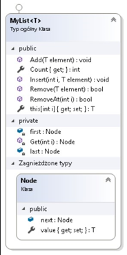
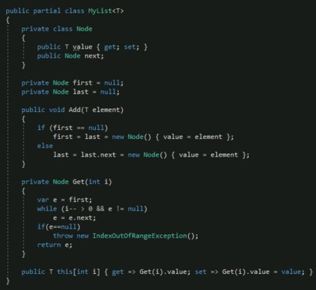
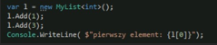

# LABORATORIUM 5 
## TREŚCI KSZTAŁCENIA: PRACA Z KOLEKCJAMI, TYP WYLICZENIOWY, WYJĄTKI 
### Typ wyliczeniowy 
Wyliczenie to zbiór nazwanych, stałych wartości. Typy takie w języku C# deklarowane są za pomocą słowa kluczowego enum. 

Wyliczenia to wartościowy typ danych. Innymi słowy, wyliczenie zawiera swoje własne wartości, których nie może dziedziczyć oraz przekazać przez dziedzicznie. 
 
```c#
//użycie // przykład 1 
int poczatek = (int)weekdays.Monday; // rzutowanie typu wyliczeniowgo na wartość całkowitą 
int koniec = (int)weekdays.Sunday; 
Console.WriteLine("Poniedzialek: {0}", poczatek); 
Console.WriteLine("Niedziela: {0}", koniec); 
Console.ReadLine(); 
 
// przykład 2 
Level myVar = Level.Medium; 
Console.WriteLine(myVar); 
 
Level myVar1 = Level.Medium; switch (myVar1) 
{     case Level.Low: 
        Console.WriteLine("Low level");         break;     case Level.Medium: 
        Console.WriteLine("Medium level");         break;     case Level.High: 
        Console.WriteLine("High level");         break; 
} 
 
//definicja typ wyliczeniowy 
// Domyślna wartość typu wyliczeniowego to 0 
// Zmieniamy wartość 'Poniedziałku' na 1 - pierwszy dzień tygodnia 
// Następnie sprawdzimy czy deklaracja jest poprawna enum weekdays 
{ 
    Monday = 1, 
    Tuesday, 
    Wednesday, 
    Thursday, 
    Friday, 
    Saturday, 
    Sunday 
}  enum Level { 
    Low, 
    Medium, 
    High 
} 
```

### Wyjątki 
Wyjątki to problemy, które pojawiają się w trakcie wykonywania programu. W języku C# wyjątki to odpowiedź na nieoczekiwane zdarzenia do których dochodzi w trakcie wykonywania programu. Możemy do nich zaliczyć próbę dzielenia przez 0. Wyjątki pozwalają na przeniesienie kontroli z jednej części programu do innej. W C# wyjątki są obsługiwane za pomocą czterech słów kluczowych: try, catch, finally oraz throw. 

•	try - określa blok kodu dla którego obsługa wyjątków jest aktywna. Składa się z jednej lub większej ilości bloków catch; 

•	catch - program wyłapuje wyjątki w miejscu w którym chcesz te wyjątki obsłużyć. Słowo kluczowe catch wskazuje miejsce wyłapania wyjątku; 

•	finally - blok ten jest używany do wywoływania pewnego bloku poleceń niezależnie od tego czy wyjątek został wyrzucony czy nie. Dla przykładu, jeżeli został otwarty plik musi on zostać zamknięty nie ważne czy błąd został rzucony czy nie; 

•	throw - program rzuca wyjątek kiedy pojawi się problem. Odbywa się to za pomocą słowa kluczowego throw. 

Składnia: `try`
```c#
{ 
    JakiśKod(); 
} 
catch (Exception e) 
{ 
    //kod wykonywany po wystąpieniu wyjątku 
} finally 
{ 
    //kod wykonywany na końcu 
} 
try { 
    int[] myNumbers = { 1, 2, 3 };     Console.WriteLine(myNumbers[10]); 
} 
catch (Exception e) 
{ 
    Console.WriteLine("Something went wrong."); 
} finally 
{ 
    Console.WriteLine("The 'try catch' is finished."); 
}
```
Instrukcja throw jest używana razem z klasą wyjątków. W języku C# dostępnych jest wiele klas wyjątków: 	`ArithmeticException`, 	`FileNotFoundException`, 	`IndexOutOfRangeException`, `TimeOutException` itp: 

```c#
checkAge(15); 
 
static void checkAge(int age) 
{ 
    if (age < 18) 
    { 
        throw new ArithmeticException("Access denied - You must be at least 18 years old.");     }     else 
    { 
        Console.WriteLine("Access granted - You are old enough!"); 
    } 
}
```

### Kolekcje 
Kolekcje - zbiory elementów różnego lub tego samego typu. 

Kolekcje możemy porównać do tablic jednak kolekcje zamiast przetrzymywać typy wartościowe przetrzymują elementy kolekcji jako obiekty. Niesie to ze sobą pewne konsekwencje. Tablica przechowuje dane określonego typu natomiast kolekcja przetrzymuje wszystko jako obiekty, nie musimy podawać typu więc za każdym razem musi zostać wykonane rzutowanie. Kolekcje w przeciwieństwie do tablic nie mają określonego rozmiaru, w zależności od potrzeb zmieniają dynamicznie rozmiar. Więcej informacji na temat kolekcji: http://msdn.microsoft.com/plpl/library/System.Collections.aspx  

### Kolekcja ArrayList 

Kolekcja ArrayList jest bardzo podobna do tablic i można ją traktować jako ulepszenie tablic. Pozwala w przeciwieństwie do tablic usuwać lub dodawać elementy w środku zbioru, pozostałe elementy zostają przesunięte. 
Wybrane metody dostępne w ArrayList: 

•	Add() - dodaje obiekt na końcu kolekcji ArrayList, 

•	Remove() - usuwa wybrany element z kolekcji, 

•	Insert() - dodaje element do kolekcji pod określonym indeksem, 

•	Clear() - czyści zawartość kolekcji, 

•	ToArray() - kopiuje zawartość kolekcji do tablicy obiektów, 

•	IndexOf() - wyszukuje indeks wybranego elementu, 

•	RemoveRange() - kasuje elementy z określonego przedziału. 

•	Sort() - sortuje elementy, 

•	Reverse() - odwraca kolejność elementów kolekcji. 

Więcej 	informacji 	na 	temat 	kolekcji 	`ArrayList`: 	[link](http://msdn.microsoft.com/plpl/library/system.collections.arraylist.aspx)

### Kolekcja HashTable 

`HashTable` pozwala na użycie innych indeksów aniżeli liczby całkowite. Składa się z dwóch tablic, w której jedna tablica przechowuje klucze a druga wartości przypisane tym kluczom. Zarówno klucz jak i wartość są obiektami. Klucze nie mogą się powtarzać, dlatego została zaimplementowana metoda ContainsKey(), która sprawdza czy dany klucz już istnieje. 
W kolekcji HashTable nie ma typowania, dlatego możemy używać różnych typów w obrębie jednej kolekcji. 
Kolekcja HashTable jest Thread Safety a więc możemy z niej korzystać w aplikacji wielowątkowej, wiele wątków może w tym samym czasie odczytywać dane z kolekcji jednak tylko jeden wątek może zapisywać do kolekcji. Więcej informacji na temat kolekcji HashTable: [link](http://msdn.microsoft.com/pl-pl/library/system.collections.hashtable.aspx)  

### Kolekcja SortedList 
Kolekcja `SortedList` działa podobnie do HashTable jednak wartości w kolekcji są sortowane po kluczach. Podczas umieszczania elementów w kolekcji, automatycznie zostaje on umieszczony w odpowiednim miejscu. Więcej informacji na temat kolekcji SortedList: [link](http://msdn.microsoft.com/plpl/library/system.collections.sortedlist.aspx)

### Kolekcja Queue - Kolejka 
Kolekcja `Queue` działa według mechanizmu `FIFO`. Elementy dodawane do kolejki zawsze zostaje umieszczony na końcu, natomiast elementy pobierane są z początku. Za pomocą metody Equeue() dodajemy elementy do kolejki, natomiast za pomocą metody `Dequeue()` pobieramy elementy z kolejki. 
Więcej 	informacji 	na 	temat 	kolekcji 	Queue: 	[link](http://msdn.microsoft.com/plpl/library/system.collections.queue.aspx) 

### Kolekcja Stack - Stos 
Kolekcja `Stack` działa według mechanizmu LIFO. Elementy zarówno dodawane jak i pobierane są ze spodu stosu. Ostatnio dodany element będzie pierwszym elementem do pobrania ze stosu. Za pomocą metody Push() dodajemy elementy do stosu, natomiast za pomocą metody Pop() wyciągamy elementy ze stosu. Więcej informacji na temat kolekcji Stack: [link](http://msdn.microsoft.com/plpl/library/system.collections.stack.aspx)
 
 	 
## Zadania do samodzielnego rozwiązania 

### [Zadanie 1.](https://github.com/dawidolko/Programming-Cs/tree/main/object-oriented%20programming%202/Lab5/TASK1) 
Napisz metodę, która jako parametr będzie przyjmowała napis i wypisywała na standardowe wyjście jego długość. 

•	Przekaż do tej metody null i zobacz, jaki wyjątek został zgłoszony. 

•	Otocz wywołanie metody blokiem try-catch, przechwyć ten wyjątek i wypisz na standardowe wyjście ślad stosu wywołań z chwili zgłoszenia wyjątku. (StackTrace). 

•	Bezpośrednio po wypisaniu jego śladu zgłoś obsługiwany wyjątek ponownie. 

•	Dołącz obsługiwany wyjątek do nowo tworzonego wyjątku Exception jako przyczynę jego powstania. 

### [Zadanie 2.](https://github.com/dawidolko/Programming-Cs/tree/main/object-oriented%20programming%202/Lab5/TASK2) 
Napisz trzy nowe wyjątki oraz metodę, która za każdym wywołanie będzie losowo zgłaszała jeden z nich. 

•	Otocz wywołanie tej metody instrukcją try-catch zawierającą po jednym bloku catch dla każdego z wyjątków. Niech każdy blok catch wypisuje, który wyjątek złapała. 

### [Zadanie 3.](https://github.com/dawidolko/Programming-Cs/tree/main/object-oriented%20programming%202/Lab5/TASK3) 
W poniższym przykładzie w bloku try jest pięć instrukcji. Każda z nich może zgłosić taki sam wyjątek. Zaproponuj rozwiązanie, które w kodzie obsługi wyjątku pozwoli sprawdzić, w której instrukcji on wystąpił. 
```c#
public class SomeClass{
  public void CanThrowException() 
    { 
        if (new Random().Next(5) == 0)
        throw new Exception(); 
    }
}
 
class Program 
{ 
    static void Main(string[] args) 
    { 
        SomeClass someClassObj = new SomeClass();
          try         { 
            someClassObj.CanThrowException();
            someClassObj.CanThrowException();
            someClassObj.CanThrowException();
            someClassObj.CanThrowException();
            someClassObj.CanThrowException(); 
        } 
        catch (Exception e) 
        { 
            //jakiś kod obsługi 
        } 
    } 
}
```
### [Zadanie 4.](https://github.com/dawidolko/Programming-Cs/tree/main/object-oriented%20programming%202/Lab5/TASK4) 
Zaimplementuj metodę kopiującą obiekt (Ma zostać skopiowana każda zmienna obiektu, a nie referencja). W przypadku braku parametru (np. parametr null) należy zgłosić wyjątek ze stosownym komunikatem. (można wykorzystać klasy zaprogramowane na poprzednich zajęciach). 

### [Zadanie 5.](https://github.com/dawidolko/Programming-Cs/tree/main/object-oriented%20programming%202/Lab5/TASK5) 
Zmodyfikuj poprzednie zadanie tworząc własny typ danych. Następnie zaimplementuj interfejs IClonable i wykonaj jeszcze raz zadanie pierwsze. Sprawdź działanie metody MemberwiseClone(). 

### [Zadanie 6.](https://github.com/dawidolko/Programming-Cs/tree/main/object-oriented%20programming%202/Lab5/TASK6) 
Zaproponuj konsolową aplikację z wykorzystaniem technik programowania obiektowego z uwzględnieniem poniższych założeń: 

1.	Należy zaimplementować własną kolekcję będącą generyczną listą. 

2.	Lista ma posiadać strukturę odpowiadającą diagramowi klas zgodnie z poniższym rysunkiem. 

Wskazówka znajduje się w załączniku 1. 

<br>
  
3.	Utworzyć kod testujący kolejki przechowującej obiekty typu int, który między innymi wypisze listę liczb parzystych. 
 	 
Wskazówka: 
Przykładowy kod realizujący strukturę listy przedstawiono na poniższym listingu: 

<br>
  
•	MyList<T> jest klasą generyczną tzn. Obiekt naszej listy może przechowywać dowolny typ obiektu zdefiniowany (nazwa powiązanej klasy pod literką T) w trakcie tworzenia instancji naszej klasy. 

•	Nasza klasa posiada wewnętrzną prywatną klasę Node (ukrytą, niedostępną poza klasą), służącą jako kontener dla przechowywanych obiektów typu T. 

•	T this [int i] to przeciążenie operatora tablicowego, przez którego możliwe jest odwołanie do listy poprzez indeks np. lista[1] 

•	Modyfikator partial class skutkuje, iż możliwe jest zdefiniowanie kolejnych klas o tej samej nazwie, które ostatecznie tworzą jedną połączoną klasę. 

W tej formie klasa oferuje nam jedynie możliwość dodawania i odwoływania się do elementu po indeksie. 
  
<br>
