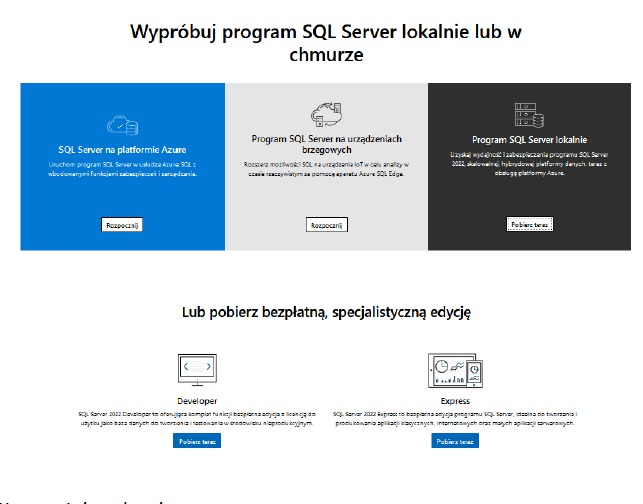

# LABORATORIUM 7 
## TREŚCI KSZTAŁCENIA: PLIKI `CSV` ORAZ `ADO.NET`

Bardzo często, gdy wypuszczamy jakiś produkt lub rozwiązanie programistyczne na rynek lub pracujemy w jakiejś firmie spotykamy się z zadaniami z działów analizy, sprzedaży itd., których zadaniem jest przygotowanie raportów lub eksportu danych. 

`CSV` (ang. comma-separated values, wartości rozdzielone przecinkiem) – format przechowywania danych w plikach tekstowych i odpowiadający mu typ MIME text/csv. Każdy rekord rozpoczyna się w nowej linii kodu „CLFR”, zaś konkretne wartości są oddzielane znakiem przecinka „,”. 

<br>
  
Zapis w formacie csv:

```
Kowalski,Jan,Kłodzko 
Nowak,Zenon,Szczecin 
Brzęczyszczykiewicz,Grzegorz,Chrząszczyżewoszyce
```

Jeśli chcemy skorzystać ze znaków specjalnych, to muszą zostać one ujęte w cudzysłów. 

### Export 

Aby wyeksportować plik wystarczy, że przeiterujemy po każdym elemencie z naszej listy, a za pomocą StringBuildera utworzymy string w formacie csv. Na koniec pozostanie nam tylko zapisanie danych do pliku. 

```
StringBuilder sb = new StringBuilder(); sb.AppendLine("Nazwisko,Imie,Miasto"); foreach (var item in items) 
{ 
    sb.AppendLine($"{item.Nazwisko},{item.Imie},{item.Miasto}"); 
}
```

### Import 

Import plików typu csv jest bardzo podobny do czytania plików txt, który już przerabialiśmy. Jako że szablon pliku do importu musi być stały (założony przez projektanta/programistę rozwiązania), to możemy czytać plik linia po linii, a następnie każdą linię podzielić na tablicę wartości przy pomocy funkcji split. 
```
var vals = string.Join(",", wczytanyWiersz);
```

CSV helper [link](https://joshclose.github.io/CsvHelper/)
 
### Przykład 1. 
Kod źródłowy dostępny w `ExampleCSV.zip`

W celu operacji na plikach CSV należy użyć klasę CsvHelper. Klasa dostępna jest w pakiecie CsvHelper, który należy zainstalować za pomocą menedżera pakietów NuGet albo korzystając z wersji okienkowej czyli opcji “Manage NuGet Packages…” albo za pomocą “Package Manager Console” (dostępna z menu Tools->NuGet Package Manager). Install-Package CsvHelper 

```c#
namespace ExampleCSV 
{ 
    internal class Person 
    { 
        public string FirstName { get; set; }         public string LastName { get; set; }         public int Age { get; set; } 
    } } 
using CsvHelper; using System.Globalization; using ExampleCSV; 
 
string filePath = "sample.csv"; 
 
// Zapis danych do pliku CSV 
WriteDataToCsv(filePath); 
 
// Odczyt i wyświetlanie danych z pliku CSV 
ReadAndDisplayDataFromCsv(filePath); 
 
// Przeszukiwanie danych w pliku CSV 
SearchDataInCsv(filePath, "John"); 
 
Console.ReadLine(); 
 
static void WriteDataToCsv(string filePath) 
{ 
    List<Person> people = new List<Person> 
    { 
            new Person { FirstName = "John", LastName = "Doe", Age = 25 },             new Person { FirstName = "Alice", LastName = "Smith", Age = 30 },             new Person { FirstName = "Bob", LastName = "Johnson", Age = 22 } 
        }; 
 
    using (var writer = new StreamWriter(filePath)) 
    using (var csv = new CsvWriter(writer, CultureInfo.InvariantCulture)) 
    { 
        csv.WriteRecords(people); 
    } 
 
    Console.WriteLine("Dane zapisane do pliku CSV."); 
}  
static void ReadAndDisplayDataFromCsv(string filePath) 
{ 
    using (var reader = new StreamReader(filePath)) 
    using (var csv = new CsvReader(reader, CultureInfo.InvariantCulture)) 
    { 
        var records = csv.GetRecords<Person>().ToList();          Console.WriteLine("\nDane odczytane z pliku CSV:");         foreach (var person in records) 
        { 
            Console.WriteLine($"Imię: {person.FirstName}, Nazwisko: 
{person.LastName}, Wiek: {person.Age}"); 
        } 
    } 
}  
static void SearchDataInCsv(string filePath, string searchTerm) 
{ 
    using (var reader = new StreamReader(filePath)) 
    using (var csv = new CsvReader(reader, CultureInfo.InvariantCulture)) 
    { 
        var records = csv.GetRecords<Person>().Where(p => 
p.FirstName.Contains(searchTerm) || p.LastName.Contains(searchTerm)).ToList();  
        Console.WriteLine($"\nWyniki wyszukiwania dla '{searchTerm}':");         foreach (var person in records) 
        { 
            Console.WriteLine($"Imię: {person.FirstName}, Nazwisko: 
{person.LastName}, Wiek: {person.Age}"); 
        } 
    } }
```

### ADO.NET 

W języku C# mamy możliwość budowania bazodanowych aplikacji. Pozwalają one na ułatwione przechowywanie danych naszej aplikacji. Najczęściej korzystamy z relacyjnych baz danych takich jak MS SQL, MySQL, Oracle, PostgreSQL i inne. 

 Skrypt ten ma na celu zrozumienie różnych pojęć związanych z dostępem do danych przy użyciu ADO.NET. ADO.NET to zestaw klas na platformie .NET, które ułatwiają dostęp do danych. Technologia ta istnieje już od dłuższego czasu i zapewnia kompletny zestaw bibliotek pozwalający na dostęp do danych. Główną zaletą ADO.NET jest fakt, że pozwala aplikacją na dostęp do różnego typu danych przy użyciu tej samej metodologii. Jeżeli wiemy jak przy użyciu ADO.NET uzyskać dostęp do bazy danych SQL nie będziemy mieli problemu z dostępem do innego rodzaju bazy danych, tj. Oracle czy MS Access. Będziemy jednak musieli użyć innego zestawu klas. Wielu programistów używa obecnie ORM'ów (Object Related Mapping), aby uzyskać dostęp do baz danych. ORM zapewnia wiele sposobów dostępu do danych oraz uwalnia programistów od ciągłego i żmudnego pisania kodu. Jednak znajomość i zrozumienie ADO.NET jest niezbędne dla początkujących programistów .NET ponieważ pozwala na lepsze zrozumienie metod dostępu do danych. Niezbędne nagłówki w celu korzystanie z ADO.NET 

```c#
using System.Data.SqlClient; using System.Data; 
Podłączenie do bazy oraz pobierania danych: 
try { 
    string connectionString = 
@"Datasource=.\SQLExpress;database=programowanieOb;Trusted_Connection=True";     SqlConnection connection = new SqlConnection(connectionString);     connection.Open(); 
    SqlCommand sqlCommand = connection.CreateCommand();     sqlCommand.CommandText = "SELECT * FROM students";     SqlDataReader reader = sqlCommand.ExecuteReader(); 
    Console.WriteLine("Wiersze znajdujące się w tabeli students:");     while (reader.Read()) 
    { 
        Console.WriteLine(reader["Nazwisko"].ToString() + " " + 
        reader["Imie"].ToString() + " " + reader["NrAlbumu"].ToString() + " " +         reader["Grupa"].ToString()); 
    } 
    reader.Close();     connection.Close(); 
    Console.ReadKey(); 
} 
catch (SqlException e) 
{ 
    Console.WriteLine("error"); 
    Console.WriteLine(e.Message); 
}
```

### Connection strings 

Różne bazy danych mają różne connection stringi. Ciężko by programista spamiętał wszystkie. Dlatego pomocne może okazać się skorzystanie z pomocy dokumentacji lub narzędzia zewnętrznego np. https://www.connectionstrings.com/ 

### Klasy kontenerów danych 

DataReader - jest obiektem, którego używamy, gdy chcemy uzyskać dostęp po kolei do wyników zwracanych z bazy danych. Obiekt DataReader jest używany, aby poruszać się do przodu w sposób sekwencyjny w trakcie wykonywania zapytania. Jest używany z obiektem Command; 

Dataset - może być traktowany jako reprezentacja w pamięci danych z bazy danych. Rezutalt zapytania do bazy danych może być przechowywany w tej kolekcji. Dataset zawiera DataTables.Z kolei DataTables zawiera w sobie 
DataRow oraz DataColumn. DataSet lub DataTable może być używany z Command i obiektem DataAdapter do przechowywania wyników zapytania; 

DataAdapter - jest obiektem używanym do wypełniania DataSet/DataTable wynikiem zapytania z bazy danych. Może być traktowany jako łącznik pomiędzy połączonym i odłączonym modelem danych. Obiekt Command jest używany do wywołania zapytania a DataAdapter użyje obiektu Command, aby wypełnić DataSet/DataTable danymi zwracanymi w wyniku odpytywania bazy danych. 

### Polecenie Command 
Po przygotowaniu połączenia z bazą danych następnym krokiem jest poinformowanie bazy danych o operacji, którą chcemy przeprowadzić. Możemy tego dokonać za pomocą obiektu Command. Będziemy również używać SqlCommand aby powiedzieć bazie danych o operacji, którą chcemy zrealizować. Podstawowe komendy na bazie danych to: 

•	Polecenie Select – zwraca zestaw wierszy do aplikacji. 

•	Polecenie Insert – zwraca liczbę wierszy dodanych. 

•	Polecenie Delete – zwraca liczbę wierszy usuniętych. 

•	Polecenie Update – zwraca liczbę wierszy zaktualizowanych. 

Wszystkie z powyższych poleceń oczekują prawidłowej składni SQL. Zapytanie takie może być przekazane z aplikacji lub być napisane w formie procedury składowanej a wykonane przy użyciu SqlCommand. 

```c#
SqlCommand cmd = new SqlCommand();
cmd.CommandType = CommandType.Text;
string query = "select * from Students";
cmd.CommandText = query;
```

W większości przypadków będziemy chcieli wyciągać z bazy danych już przefiltrowane rekordy, czyli będziemy musieli wykorzystać parametry. Możemy to zrobić na dwa sposoby: 

### 1.	Wklejając je w commandText: 
```c#
var studentNrAlbumu = "12345"; SqlCommand cmd = new SqlCommand(); cmd.CommandType = CommandType.Text; 
string query = "select * from Students where NrAlbumu = " + studentNrAlbumu; cmd.CommandText = query; 
```
### 2.	Wykorzystując sparametryzowane zapytanie: 
```c#
var studentNrAlbumu = "12345"; SqlCommand cmd = new SqlCommand(); cmd.CommandType = CommandType.Text; 
string query = "select * from Person where NrAlbumu = @studentNo"; cmd.CommandText = query; cmd.Parameters.Add(param); 
```
### Polecenia Insert, Delete, Update 

Polecenia takie jak: Insert, Update oraz Delete są wykonywane przez wywołanie metody `ExecuteNonQuery()`.Polecenia te mogą być przekazywane jako zapytania z aplikacji bądź przez wywołanie procedur składowanych. 
```c#
var studentNrAlbumu = "12345"; SqlCommand cmd = new SqlCommand(); cmd.CommandType = CommandType.Text; 
string commandText = "Delete from Students where NrAlbumu = @studentNo"; cmd.CommandText = commandText; 
SqlParameter param = new SqlParameter("@studentNo", studentNrAlbumu); cmd.Parameters.Add(param); int result = cmd.ExecuteNonQuery();
```
 	  
### Przykład 2. 
Przykład programu prezentujący działania związane z zapisem i odczytem danych w bazie danych SQL. Do tego celu używany jest framework ADO.NET, a w przykładzie używana jest baza danych SQL Server. Przed uruchomieniem kodu, należy upewnić się, że ma się skonfigurowaną bazę danych SQL Server oraz dodało się odpowiednią referencję do projektu. (Patrz załącznik 1). Kod źródłowy dostępny w pliku `DBConExample.zip` 

```c#
using System; 
using System.Data.SqlClient; 
 
string connectionString = "Data Source=(localdb)\\MSSQLLocalDB;Initial 
Catalog=SampleDB;Integrated Security=True"; 
 
// Przykładowa tabela "People" w bazie danych 
string createTableQuery = @"             CREATE TABLE People 
            ( 
                Id INT PRIMARY KEY IDENTITY(1,1), 
                FirstName NVARCHAR(50), 
                LastName NVARCHAR(50), 
                Age INT 
            )"; 
 
// Przykładowe dane 
string[] names = { "John", "Alice", "Bob" }; string[] lastNames = { "Doe", "Smith", "Johnson" }; int[] ages = { 25, 30, 22 }; 
 
using (SqlConnection connection = new SqlConnection(connectionString)) 
{ 
    connection.Open(); 
 
    // Tworzenie tabeli (jeśli nie istnieje) 
    using (SqlCommand createTableCommand = new SqlCommand(createTableQuery, connection))     {         try         { 
            createTableCommand.ExecuteNonQuery();             Console.WriteLine("Tabela People utworzona."); 
        } 
        catch (Exception ex) 
        { 
            Console.WriteLine($"Błąd przy tworzeniu tabeli: {ex.Message}"); 
        } 
    } 
 
    // Dodawanie danych do tabeli     for (int i = 0; i < names.Length; i++) 
    { 
        string insertDataQuery = $"INSERT INTO People (FirstName, LastName, Age) VALUES ('{names[i]}', '{lastNames[i]}', {ages[i]})"; 
 
        using (SqlCommand insertDataCommand = new SqlCommand(insertDataQuery, connection))         {             try             { 
                insertDataCommand.ExecuteNonQuery(); 
                Console.WriteLine($"Dodano osobę: {names[i]} {lastNames[i]}"); 
            } 
            catch (Exception ex) 
            { 
                Console.WriteLine($"Błąd przy dodawaniu danych: {ex.Message}"); 
            } 
        } 
    } 
 
    // Odczyt danych z tabeli 
    string selectDataQuery = "SELECT * FROM People"; 
 
    using (SqlCommand selectDataCommand = new SqlCommand(selectDataQuery, connection))     { 
        using (SqlDataReader reader = selectDataCommand.ExecuteReader()) 
        { 
            Console.WriteLine("\nLista osób w bazie danych:");             while (reader.Read()) 
            { 
                string firstName = reader["FirstName"].ToString();                 string lastName = reader["LastName"].ToString();                 int age = Convert.ToInt32(reader["Age"]); 
 
                Console.WriteLine($"Imię: {firstName}, Nazwisko: {lastName}, 
Wiek: {age}"); 
            } 
        } 
    } 
}
```
UWAGA!!! NALEŻY PAMIĘTAĆ O DOSTOSOWANIU CONNECTION STRING DO SWOJEJ BAZY DANYCH. 
W celu dostosowania connection string do swojej bazy danych, należy dostarczyć odpowiednie informacje o swoim środowisku bazy danych. Oto ogólna struktura connection string dla bazy danych SQL Server i przykładowa konfiguracja: 

```c#
string connectionString = "Server=<server_address>;Database=<database_name>;User Id=<user_id>;Password=<password>;";
```
gdzie: 

•	`<server_address>` to adres serwera baz danych, np. (localdb)\MSSQLLocalDB lub localhost dla lokalnej instancji. 

•	`<database_name>` to nazwa twojej bazy danych. 

•	`<user_id>` i `<password>` to dane uwierzytelniające dla dostępu do bazy danych. Jeśli korzystasz z uwierzytelnienia Windows (Integrated Security), możesz pominąć te pola. 
Oto kilka przykładów dostosowania connection string do różnych sytuacji: 

•	Dla lokalnej instancji SQL Server z uwierzytelnianiem Windows: 
`string connectionString = "Data Source=(localdb)\\MSSQLLocalDB;Initial Catalog=<database_name>;Integrated Security=True;";` 

•	Dla lokalnej instancji SQL Server z uwierzytelnianiem SQL Server: 
`string connectionString = "Data Source=(localdb)\\MSSQLLocalDB;Initial Catalog=<database_name>;User Id=<user_id>;Password=<password>;"; `

•	Dla zdalnej instancji SQL Server z uwierzytelnianiem SQL Server: 
`string 	connectionString 	= 	"Data 	Source=<server_address>;Initial 
Catalog=<database_name>;User Id=<user_id>;Password=<password>;"; `
 	 
### Załącznik 1. Konfiguracja bazy danych SQL Server oraz dodanie referencji. 

### Instalacja SQL Server 

1. Pobierz i zainstaluj SQL Server: Udaj się na oficjalną stronę Microsoftu [link](https://www.microsoft.com/pl-pl/sql-server/sql-server-downloads ), aby pobrać wersję SQL Server. Zainstaluj ją zgodnie z instrukcjami dostępnymi na stronie. 

<br>
  
### Utworzenie bazy danych 
1.	Otwórz SQL Server Management Studio (SSMS): Uruchom SSMS i zaloguj się do swojej lokalnej instancji SQL Server. 

2.	Utwórz nową bazę danych: Użyj poniższego polecenia SQL, aby utworzyć nową bazę danych. Możesz użyć tego polecenia w oknie zapytań SSMS. 
CREATE DATABASE SampleDB; 

### Dodanie referencji do projektu 
1.	Otwórz projekt w Visual Studio: Uruchom Visual Studio i otwórz projekt, w którym chcesz używać bazy danych SQL Server. 

2.	Dodaj referencję do System.Data.SqlClient: Kliknij prawym przyciskiem myszy na referencjach projektu w Solution Explorer i wybierz "Add" -> "Reference...". W oknie "Reference Manager" przejdź do zakładki "Assemblies" i zaznacz "System.Data.SqlClient". Następnie kliknij "OK". 

### Zmiana połączenia z bazą danych w kodzie 

1. Zmień connection string: W kodzie, gdzie używasz bazy danych, dostosuj connection string do nowo utworzonej bazy danych. W przypadku projektu z przykładem z bazą danych SQL Server, możesz zmodyfikować zmienną connectionString w następujący sposób: 
`string connectionString = "Data Source=(localdb)\\MSSQLLocalDB;Initial Catalog=SampleDB;Integrated Security=True"; `
Gdzie SampleDB to nazwa utworzonej bazy danych. 

### Uruchomienie projektu 

1.	Uruchom projekt: Po wprowadzeniu zmian i dostosowaniu connection string, uruchom swój projekt, aby sprawdzić, czy jest on poprawnie skonfigurowany do korzystania z bazy danych SQL Server. 

2.	To są ogólne kroki, a konkretna konfiguracja może się różnić w zależności od środowiska, wersji SQL Server i Visual Studio. Warto też pamiętać, że w środowisku produkcyjnym należy stosować bardziej zaawansowane metody konfiguracji, takie jak korzystanie z zewnętrznych plików konfiguracyjnych do przechowywania connection stringów. 
 	  
## Zadania do samodzielnego rozwiązania 

### [Zadanie 1.]()
W oparciu o Przykład 1 należy zaprojektować aplikację konsolową zgodnie z poniższymi wymaganiami:  
Napisz program który zaprezentuje działania związane z zapisem, odczytem, modyfikacją oraz usunięciem danych przechowywyanych w pliku csv. Program ma przechowywać informacje o osobie: String imie, nazwisko, adres – typu Adres, pesel (pole posiadające ograniczenie do 11 znaków), adres e-mail. 
Pogram ma być czytelny dla użytkownika, po uruchomieniu powinno pojawić się menu główne w którym użytkownik będzie mógł wybrać opcje: 
1.	Wyświetl dane 

2.	Dodaj osobę 

3.	Modyfikuj osobę 

4.	Usuń osobę  

5.	Wyjście z programu. 

Po wybraniu Wyświetl dane na ekranie powinny zostać wyświetlone dane przechowywane w CSV. Po ich wyświetleniu powinno pojawić się menu główne.  
Po wybraniu Dodaj osobę na ekranie powinny pojawiać się komunikaty z prośbą o wpisanie danych, należy pamiętać o obsłudze wyjątków, pola nie mogą być null, pesel ma zawierać 11 znaków typu int, maila powinien zawierać @. W przypadku błędnych danych program powinien wyświetlić odpowiedni komunikat i poprosić o wpisanie danych. Po dodaniu użytkownika powinien pojawić się komunikat o dodaniu osoby do bazy i pojawia się menu główne. 
Modyfikuj osobę – program powinien poprosić użytkownika o wybranie osoby do modyfikacji poprzez podanie nr pesel, po znalezieniu osoby można modyfikować dane, jeżeli osoba nie zostanie znaleziona należy wyświetlić stosowany komunikat. Ponownie pojawia się menu główne. 
Usuń osobę – po wybraniu osoby poprzez pesel usuwamy ją z bazy przechowywanej w csv. Ponownie pojawia się menu główne. 
Program działa do momentu wybrania Wyjście z programu 
W programie każdorazowe zmiany mają być zapisane w CSV.  
Program powinien być napisany zgodnie z ideą programowania obiektowego oraz powinien przechwycić wyjątki. 

### [Zadanie 2.]() Zmodyfikuj zadanie 1 w taki sposób aby dane zapisywane były w bazie danych SQL. 
