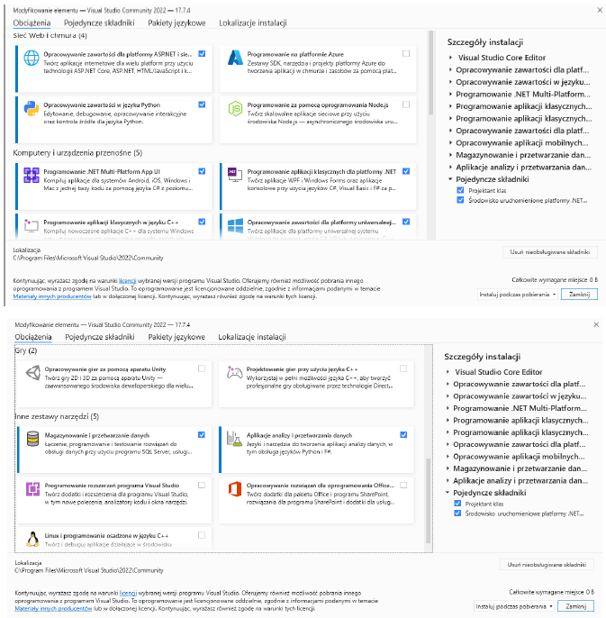

### C# Labs

C# labs are practical sessions that allow participants to deepen their knowledge and programming skills in C#. They are an integral part of learning programming, enabling you to experiment, solve problems and develop projects in a controlled environment.

**Features of C# Labs:**
- **Practical Tasks**: Participants work on real projects, which allows for practical application of theory.
- **Experiential Learning**: Direct experience writing and debugging code.
- **Developing Problem-Solving Skills**: Laboratory tasks often require creative thinking and logical reasoning.
- **Collaboration and Teamwork**: Many labs promote collaboration by teaching developers how to work in a team.
- **Progress Assessment**: Labs often include assessment components to help monitor learning progress.

C# labs are typically aimed at computer science students or those learning to program, but are also available to self-taught users and professionals who want to improve their programming skills. These classes provide invaluable experience that is crucial in developing a career in technology and software.

## TRAINING CONTENT: WORKING IN THE VISUAL STUDIO ENVIRONMENT, CREATING SIMPLE PROGRAMS IN C# (NUMBER OF HOURS: 4H).
### 1. Working in the Visual studio environment
Installation:
In order to implement C# programming issues, you need to install the following components:

 

Informacje dotyczące usługi GitHub dla VS można znaleźć pod adresem (data dostępu 19.09.2023):
[link](https://visualstudio.microsoft.com/pl/vs/github/)
