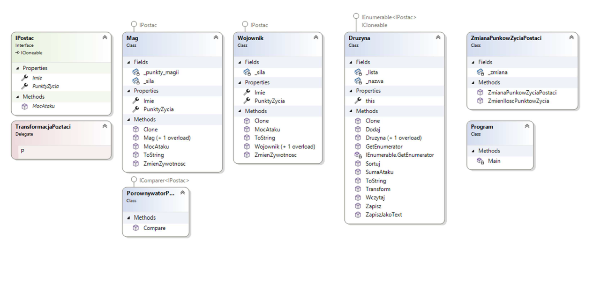

# Programowanie obiektowe C#
Zaprojektuj i zaimplementuj podstawy komputerowej gry RPG, w której może istnieć wiele typów
bohaterów. Początkowo system będzie obsługiwał tylko dwa rodzaje postaci (wojownik i mag),
jednakże w przyszłości planowane jest rozszerzenie systemu o inne rodzaje bohaterów. Wiadomo
jednak, że wszystkie postacie będą opisane nazwą, posiadają pewien poziom żywotności oraz
udostępniają operację pozwalającą obliczyć moc ataku postaci na podstawie parametrów
charakteryzujących bohatera.

Zaimplementuj klasy reprezentujące dwa typy postaci opisane następującymi atrybutami:

• Mag: imię, żywotność (w %), siła (liczba całkowita), punkty magii (liczba całkowita)

• Wojownik: imię, żywotność (w %), siła (liczba całkowita)

Zadbaj o właściwą hermetyzację, tzn. pola klas nie powinny być publiczne.

Obiekty reprezentujące bohaterów udostępniają następujące operacje:

• konstruktor pozwalający zainicjować wszystkie pola składowe,

• konstruktor domyślny ustawiający pola obiektów wg schematu:

o Wojownik: imię = „Geralt”, żywotność = 100%, siła = 3k6 (losowa wartość od 3 do 18,
wynik rzutu trzema kostkami),

o Mag: imię = „Xardas”, żywotność = 100%, siła = 1k6, punkty magii = 2k6,

• metodę pozwalającą dodać (odjąć) pewną wartość punktów żywotności. Jednak wartość
końcowa nie może spaść poniżej 0 i wzrosnąć powyżej 100%. Metoda zwraca nową wartość
żywotności.

• metodę zwracającą moc ataku postaci. Zależnie od typu bohatera wynosi ona:

o dla maga: ( punkty magii + siła ) x żywotność

o dla wojownika: siła x żywotność , lecz gdy żywotność spadnie poniżej 5% wojownik
wpada w szał i jego siła ataku równa się sile bazowej.

• przeciąż metodę ToString() zwracającą napis zawierający informacje o nazwie bohatera oraz
wartość żywotności i moc ataku.
Zaimplementuj klasę realizującą drużynę bohaterów. Klasa ta przechowuje dowolnie duży zbiór
postaci. Dla tej klasy zaimplementuj operacje:

• konstruktor pozwalający zainicjować drużynę o podanej w argumencie nazwie,

• metodę `Clone()` implementującą interfejs IClonable. Metoda zwraca wierną kopię obiektu
klonowanego.

• metodę dodającą nową postać do drużyny,

• metodę dającą dostęp (możliwość odczytu i modyfikacji) bohatera drużyny o podanym
indeksie (może to być dociążony operator [])

• metodę zwracającą sumaryczną wartość mocy ataku wszystkich członków drużyny,

• przeciążoną metodę ToStrong(), która zwraca napis zawierający nazwę drużyny, sumaryczną
moc ataku oraz pełną listę postaci.
Napisz program testujący działanie systemu. Utwórz grupę bohaterów o nazwie „Druzyna pierscienia”
i umieść w jej składzie przynajmniej po dwie postaci z każdego typu. Zmniejsz żywotność jednego z
wojowników do 3% i wypisz w terminalu zawartość drużyny: nawę, sumaryczną wartość mocy ataku i
listę uczestników grupy.

 
